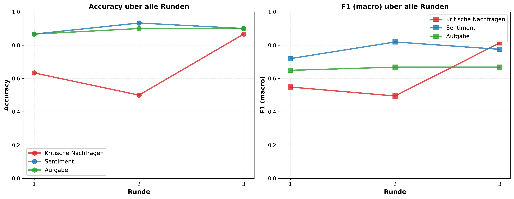
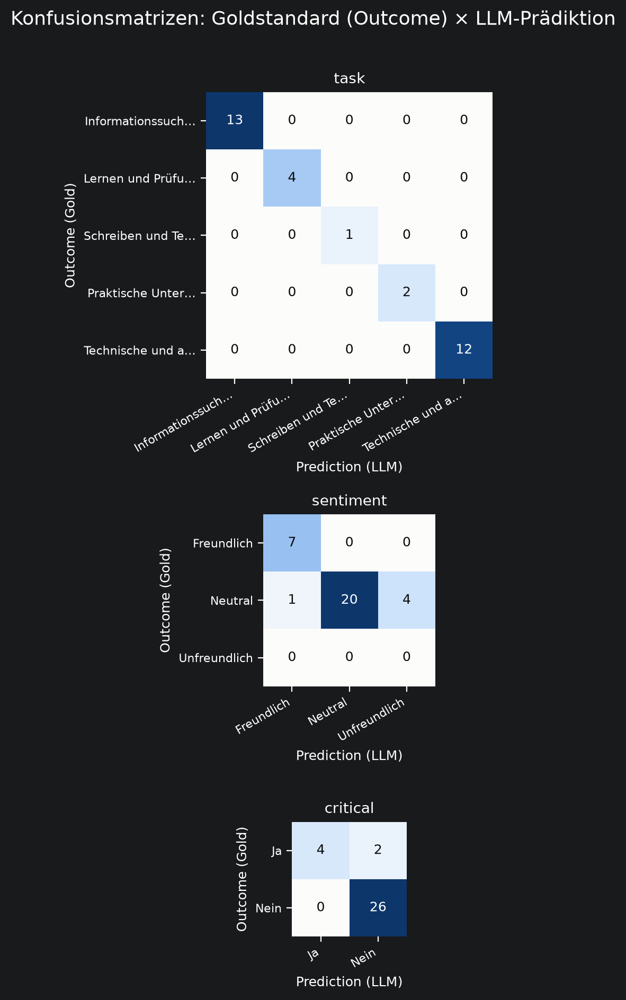

```{r}
#| label: setup
#| include: false
# Lädt Daten, Design-System und alle ggplot-Objekte (p_sent, p_krit, ...)
# aus dem Analyseskript. Danach können die Objekte in den Abbildungs-Chunks
# einfach per Namen aufgerufen werden.
source(here::here("R_code", "01_data_prep.R"))
source(here::here("R_code", "02_data_analysis.R"))
source(here::here("R_code", "03_sample_modification.R"))
source(here::here("R_code", "04_discrepancy_analysis.R"))

# Anhangstabellen werden aus den CSVs gelesen, die data_analasys.R beim Sourcen
# oben frisch nach tabs/ schreibt - so bleibt Anhang und Analyse synchron.
# Zahlen stehen in den CSVs als Text mit Dezimalkomma (0,50 statt 0.50);
# komma_align() aus 02_data_analasys.R haelt sie trotzdem rechtsbuendig.
anhang_tab <- function(datei, ordner = "tabs", ...) {
  df <- read.csv(here::here(ordner, datei), check.names = FALSE,
                 encoding = "UTF-8")
  knitr::kable(df, format = "pipe", row.names = FALSE,
               align = komma_align(df), ...)
}

#Titlee, subtitle etc deaktivieren
theme_set(
  theme_minimal() +
    theme(
      plot.title    = element_blank(),
      plot.subtitle = element_blank(),
      plot.caption  = element_blank(),
      plot.tag      = element_blank()
    )
)
```

```{r packages}
#| warning: true
#| include: false

library(here)
library(readr)
# Einzelne tidyverse-Pakete statt des Meta-Pakets: nur diese stehen in renv.lock
library(dplyr)
library(tidyr)
library(ggplot2)
library(stringr)
library(purrr)
library(forcats)
library(gt)
```

```{r globals}
#| include: false
global_digits <- 2
```
<!-- ??? kaann man beim titleblatt das "Maseterstudiengang Comp... 2 Fachsemester" über fußnoten machen das es nur einmal auf den deckblatt steht -> ähnlich wie bei deckblatt für llm evaluation -->


# Abstract {.unnumbered .unlisted}

<!-- ???statt großes sprachmodell, llm ausschreiben verwenden wir downstream auch so  -->
<!-- ??? muss mann ggf- nochmal anpassen an neunen ergebnissteil  -->
Ziel dieser Arbeit ist es, zu untersuchen, inwiefern sich Selbstauskünfte Studierender zur studienbezogenen Nutzung generativer KI-Chatbots von ihrem in gespendeten Chatverläufen beobachtbaren Nutzungsverhalten unterscheiden.
Die bisherige Forschung zur Verbreitung und Nutzung generativer Sprachmodelle im Studium stützt sich fast ausschließlich auf Befragungsdaten, obwohl solche Selbstauskünfte anfällig für Erinnerungsfehler und sozial erwünschtes Antwortverhalten sein können.
Daraus ergibt sich die Forschungsfrage, ob und in welchen Dimensionen sich berichtete und in Chatlogs beobachtete Nutzung unterscheiden, welche Nutzungsarten sich in den Chatverläufen identifizieren lassen und wie gut sich eine Klassifikation durch ein großes Sprachmodell zur systematischen Erfassung dieser Nutzungsmuster eignet.
Zur Beantwortung wurden in einer Online-Befragung Selbstauskünfte 21 Studierender zu Interaktionsstil, kritischem Prüfen von Chatbot-Antworten und studienbezogener Informationsnutzung erhoben und mit freiwillig gespendeten, mittels eines großen Sprachmodells klassifizierten Chatverläufen abgeglichen.
Eine explorative Clusteranalyse ordnet die Stichprobe vier Clustern mit unterschiedlichen Diskrepanzmustern zu.
Während Angaben zu Schreib- und Lernaufgaben weitgehend zutreffend berichtet werden, zeigen sich deutliche Abweichungen bei Informationssuche sowie praktischer und technischer Unterstützung, beim Umgangston und insbesondere beim kritischen Prüfen von Antworten.
Diese Befunde legen nahe, dass Selbstauskünfte zur KI-Nutzung konstrukt- und gruppenspezifisch verzerrt sind und nicht gleichmäßig korrigiert werden können.
Für künftige Forschung wird empfohlen, Selbstauskünfte systematisch durch Verhaltensdaten zu ergänzen und größere, breiter zusammengesetzte Stichproben sowie weitere KI-Anwendungen einzubeziehen.

\clearpage

\tableofcontents
\clearpage
\phantomsection
\addcontentsline{toc}{section}{Tabellenverzeichnis}
\listoftables

\clearpage

\phantomsection
\addcontentsline{toc}{section}{Abbildungsverzeichnis}
\listoffigures

\clearpage

# Einleitung {#sec-einleitung}

Digitale Technologien hinterlassen für viele Bereiche des menschlichen Verhaltens detaillierte Spuren.
Jede Suche, jeder Klick und jede Interaktion mit digitalen Anwendungen erzeugen Daten, die potenziell einen unmittelbaren Einblick in tatsächliche Nutzungsmuster ermöglichen.
Gleichzeitig basiert ein großer Teil der sozialwissenschaftlichen Forschung weiterhin auf einer indirekten Datenquelle: der Selbstauskunft von Personen über ihr eigenes Verhalten.
Damit stellt sich eine grundlegende methodische Frage: Wie genau stimmen die Angaben von Menschen über ihre digitale Nutzung tatsächlich mit ihrem beobachtbaren Verhalten überein?

Diese Frage gewinnt besondere Bedeutung im Kontext der Nutzung von auf künstlicher Intelligenz (KI) basierenden generativen Systemen.
Seit der breiten Verfügbarkeit von generativen KI-Chatbots wie ChatGPT werden diese Anwendungen zunehmend in alltägliche und akademische Arbeitsprozesse integriert.
Studierende nutzen generative KI unter anderem zur Informationssuche, zum Verständnis komplexer Inhalte oder zur Unterstützung beim wissenschaftlichen Schreiben [@garrel2025].
Gleichzeitig ist die Nutzung solcher Systeme im Hochschulkontext weiterhin mit normativen Fragen verbunden, etwa hinsichtlich wissenschaftlicher Integrität, Eigenständigkeit und der Rolle von KI beim Lernen.
Dadurch entsteht ein Spannungsfeld zwischen einer zunehmend verbreiteten Nutzung und einer möglicherweise zurückhaltenden Kommunikation darüber.

Die bisherige Forschung zur Nutzung generativer KI stützt sich jedoch fast ausschließlich auf Selbstauskünfte [bspw. @garrel2025; @balabdaoui2024].
Diese liefern wichtige Informationen darüber, wie Nutzende ihre eigene KI-Nutzung wahrnehmen und bewerten, unterliegen jedoch bekannten Einschränkungen hinsichtlich Erinnerungsgenauigkeit, Interpretation des eigenen Verhaltens und sozial erwünschter Antworttendenzen [@diekmann2008].
Gerade bei einem gesellschaftlich kontrovers diskutierten Thema wie der Nutzung generativer KI stellt sich daher die Frage, ob Befragungsdaten die tatsächliche Nutzung angemessen abbilden oder systematische Verzerrungen enthalten.

Digitale Logdaten eröffnen eine Möglichkeit, diese Diskrepanz zwischen berichteter und tatsächlicher Nutzung empirisch zu untersuchen.
Während solche Daten in Bereichen wie der Internet-, Smartphone- oder Social-Media-Forschung bereits genutzt werden, um die Validität von Selbstauskünften zu überprüfen [bspw. @kmetty2025; @ohme2024; @vandriel2022], wurden vergleichbare Ansätze für generative KI bislang kaum angewandt.
Die vorliegende Studie greift diese Forschungslücke auf, indem sie Selbstauskünfte von Studierenden zur Nutzung generativer KI mit tatsächlich geführten Chatverläufen vergleicht.

Daraus ergibt sich die folgende Forschungsfrage die in dieser Arbeit untersucht werden soll: <!-- ???  Vielleicht sollte der explorative charakter unserer arbeit mehr in der einleitung betont werden und ggfs. die FF age-->

*Inwiefern unterscheiden sich Selbstauskünfte Studierender zur studienbezogenen Informationsnutzung mit generativen KI-Chatbots von ihrem in gespendeten Chatlogs beobachtbaren Nutzungsverhalten?*

Zur Beantwortung dieser Forschungsfrage werden im Rahmen einer Online-Umfrage freiwillig bereitgestellte studienbezogene Chatverläufe analysiert und mit Selbstauskünften abgeglichen.
Mithilfe einer Klassifikation durch ein Large-Language-Model (LLM) werden dabei insbesondere Unterschiede zwischen berichteten und beobachtbaren Nutzungsmustern explorativ untersucht.

<!-- Gegebenenfalls die Struktur anpassen/umformulieren -->

Im Folgenden wird der vorhandene Forschungsstand dargelegt bevor unsere einzelnen Forschungsfragen daraus abgeleitet und präsentiert werden.
Daraufhin wird in @sec-methode unsere Untersuchungsmethode vorgestellt bevor die daraus resultierenden Ergebnisse aufgezeigt und in der abschließenden Diskussion interpretiert werden.

# Unterschiede zwischen angegebenem und tatsächlichem Nutzungsverhalten von KI-Chatbots {#sec-unterschiede}

## Grenzen von Selbstauskünften {#sec-grenzen}

Selbstauskünfte stellen eines der am häufigsten eingesetzten Instrumente zur Erfassung menschlichen Verhaltens, Einstellungen und Nutzungsweisen dar.
Insbesondere in der Kommunikations-, Medien- und Bildungsforschung beruhen viele empirische Untersuchungen auf Befragungsdaten, da diese vergleichsweise einfach und kostengünstig erhoben werden können.
Gleichzeitig ist seit Langem bekannt, dass Selbstauskünfte verschiedenen Fehlerquellen unterliegen und daher nicht zwangsläufig das tatsächliche Verhalten einer Person widerspiegeln [@tourangeau2000].

Das Beantworten von Surveyfragen ist ein komplexer kognitiver Prozess.
Nach dem Modell von @tourangeau2000 müssen Befragte zunächst relevante Informationen aus ihrem Gedächtnis abrufen, diese zu einer Antwort zusammenfassen, ein Urteil bilden und schließlich entscheiden, wie sie dieses Urteil auf die vorgegebenen Antwortkategorien übertragen.
Fehler können auf jeder dieser Stufen entstehen.
Erinnerungen an vergangenes Verhalten sind häufig unvollständig oder verzerrt, insbesondere wenn Ereignisse länger zurückliegen oder regelmäßig auftreten.
Statt einzelne Episoden exakt abzurufen, greifen Befragte häufig auf allgemeine Eindrücke oder Heuristiken zurück, wodurch systematische Schätzfehler entstehen können.

Darüber hinaus ist die Fähigkeit zur korrekten Selbstauskunft grundsätzlich begrenzt.
Bereits @nisbett1977 zeigten, dass Menschen häufig keinen direkten introspektiven Zugang zu den kognitiven Prozessen haben, die ihr Verhalten steuern.
Selbstauskünfte beruhen demnach oft eher auf impliziten Kausaltheorien darüber, was eine plausible Erklärung für das eigene Verhalten wäre, als auf tatsächlicher Introspektion.
Diese frühe Erkenntnis bildet die theoretische Grundlage für einen ganzen Forschungsstrang, der die Validität von Selbstauskünften systematisch gegen objektivere Vergleichsmaße prüft.

Neben Erinnerungs- und Introspektionsfehlern stellen sozial erwünschte Antworttendenzen (Social Desirability Bias) eine weitere zentrale Fehlerquelle von Selbstauskünften dar.
Darunter wird die Tendenz verstanden, Fragen so zu beantworten, dass die eigene Person in einem möglichst positiven Licht erscheint oder sozial akzeptierte Normen erfüllt werden [@larson2019; @nederhof1985].
Besonders bei sensiblen Themen besteht die Gefahr, dass Befragte unerwünschtes Verhalten herunterspielen oder gesellschaftlich erwünschtes Verhalten überbetonen.
Dabei handelt es sich nicht ausschließlich um bewusste Täuschung anderer, sondern teilweise auch um Formen der Selbsttäuschung, bei denen Personen ihr eigenes Verhalten positiver wahrnehmen als es tatsächlich ist [@nederhof1985].

Die Surveyforschung zeigt, dass solche Verzerrungen insbesondere bei sensiblen Fragestellungen auftreten und stark vom Erhebungskontext abhängen [@jann2019; @tourangeau1996; @wolter2022].
So beeinflussen unter anderem die Anwesenheit eines Interviewers, der Grad der Anonymität sowie die wahrgenommenen sozialen Konsequenzen einer Antwort das Ausmaß sozial erwünschten Antwortverhaltens [@tourangeau2007].
Befragte passen ihre Antworten dabei häufig bewusst an, um Peinlichkeiten zu vermeiden oder negative Bewertungen durch Dritte zu verhindern.
Verschiedene methodische Ansätze wie etwa indirekte Fragetechniken oder Social-Desirability-Skalen können diese Verzerrungen zwar reduzieren, beseitigen sie jedoch nicht vollständig [@bernardi2023; @harel2023; @kemper2014; @krause2022; @wolter2018].

Für die Untersuchung der Nutzung generativer KI-Chatbots könnten diese Mechanismen besonders relevant sein.
Obwohl KI-Anwendungen inzwischen weit verbreitet sind, wird ihr Einsatz im Hochschulkontext weiterhin kritisch diskutiert und mit Fragen wissenschaftlicher Integrität oder unerlaubter Unterstützung bei Studienleistungen verbunden.
Dadurch kann die Nutzung generativer KI für Studierende ein sensibles Thema darstellen.
Erste empirische Hinweise bestätigen diese Annahme: @ling2026 zeigen, dass Studierende ihre eigene KI-Nutzung deutlich geringer angeben als die Nutzung ihrer Kommilitoninnen und Kommilitonen.
Die Autor:innen führen diese Diskrepanz maßgeblich auf Social Desirability Bias zurück und argumentieren, dass Selbstberichte die tatsächliche Verbreitung von KI-Nutzung im Hochschulkontext systematisch unterschätzen könnten.

## Selbstauskünfte vs. Verhaltensdaten {#sec-selbstauskünfte}

Die beschriebenen Einschränkungen von Selbstauskünften haben dazu geführt, dass in zahlreichen Forschungsfeldern verstärkt Verhaltensdaten zur Validierung von Surveyangaben eingesetzt werden.
Während Selbstauskünfte erfassen, wie Personen ihr eigenes Verhalten wahrnehmen oder erinnern, bilden Beobachtungs- oder Logdaten tatsächliches Verhalten unmittelbar ab.
Beide Datenquellen liefern dabei unterschiedliche Informationen und sollten laut @nielsen2015 nicht als konkurrierende, sondern als komplementäre Messansätze verstanden werden.

Vergleichsstudien aus unterschiedlichen Anwendungsbereichen zeigen, dass Selbstauskünfte häufig nur begrenzt mit beobachtetem Verhalten übereinstimmen.
So fanden @nielsen2015 für die Beurteilung von Alltagskompetenzen bei Personen mit Depression, dass zwischen Selbstauskunft und Beobachtung nur ein geringer Zusammenhang bestand, was die Autorinnen als Argument für die Kombination beider Erhebungsmethoden werten.

Ähnliche Ergebnisse zeigen sich auch in anderen Forschungsbereichen.
Im Gesundheits- und Verhaltensbereich fanden @kendall2004 für lebensmittelhygienisches Verhalten zwar für einen Teil der Items brauchbare Übereinstimmungen zwischen Fragebogenangaben und beobachtetem Verhalten, jedoch auch systematische Abweichungen bei konkreten Handlungsschritten, die im Interview kaum sichtbar wurden.
Auch Metaanalysen aus der Kriminologie berichten lediglich moderate Zusammenhänge zwischen selbstberichtetem delinquentem Verhalten und offiziellen Verhaltensdaten, wobei die Übereinstimmung je nach Art des Verhaltens und Erhebungsmethode erheblich variiert [@li2026].

Neben der begrenzten Übereinstimmung weisen neuere Arbeiten darauf hin, dass Messfehler in Selbstauskünften nicht ausschließlich zufällig auftreten, sondern systematischen Mustern folgen.
Eine Analyse der UK Biobank von @schoeler2025 zeigt beispielsweise, dass selbst vermeintlich stabile Selbstberichte über persönliche Merkmale über verschiedene Erhebungszeitpunkte hinweg teilweise erhebliche Inkonsistenzen aufweisen.
Dieser Befund verdeutlicht, dass Verzerrungen in Selbstauskünften nicht nur zufällig auftreten, sondern mit weiteren Personenmerkmalen konfundiert sein können.

Methodische Rahmenbedingungen der Erhebung selbst scheinen dabei eine untergeordnete Rolle zu spielen: @sharpe2025 fanden für Studierendenstichproben nur geringe Unterschiede in der Datenvalidität zwischen Labor- und Online-Erhebung, wohl aber Unterschiede je nach eingesetztem Prüfverfahren für invalide Antwortmuster.

Die Befunde verdeutlichen, dass Selbstauskünfte zwar eine zentrale und häufig unverzichtbare Datenquelle darstellen, ihre Validität jedoch nicht selbstverständlich vorausgesetzt werden kann.
Der Vergleich mit objektiveren Verhaltensdaten ermöglicht es, systematische Abweichungen zwischen berichteter und tatsächlicher Verhaltensausführung zu identifizieren und potenzielle Ursachen dieser Diskrepanzen näher zu untersuchen.
Insbesondere in Forschungsfeldern, in denen Verhaltensdaten zunehmend verfügbar sind, eröffnet die Kombination beider Datenquellen daher neue Möglichkeiten zur Bewertung der Aussagekraft von Selbstauskünften und zur Verbesserung empirischer Messungen.

## Digitale Verhaltensdaten und Data Donations {#sec-digitaldaten}

Mit der zunehmenden Digitalisierung menschlichen Verhaltens stehen Forschenden heute jedoch neue Formen objektiver Verhaltensdaten zur Verfügung.
Insbesondere digitale Trace-Daten ermöglichen es, tatsächliches Nutzungsverhalten ohne ausschließliche Abhängigkeit von Selbstauskünften zu erfassen.
Im Gegensatz zu Selbstauskünften entstehen diese Daten unmittelbar während der Nutzung digitaler Anwendungen und sind daher nicht auf Erinnerungsleistungen oder subjektive Einschätzungen der Befragten angewiesen.
Logdaten, Serverdaten oder geräteinterne Nutzungsprotokolle ermöglichen damit eine deutlich detailliertere Erfassung individuellen Verhaltens und werden zunehmend als Ergänzung oder Alternative zu klassischen Surveydaten eingesetzt [@ohme2024].

Besonders umfangreich ist die Evidenz aus der Forschung zur Internet-, Smartphone- und Social-Media-Nutzung.
Zahlreiche Studien haben dort Selbstauskünfte mit objektiv erfassten Logdaten verglichen und kommen übereinstimmend zu dem Ergebnis, dass beide Datenquellen häufig nur moderat miteinander korrelieren.
@scharkow2016 zeigte beispielsweise anhand von Client-Logdaten, dass sowohl die Häufigkeit als auch die Dauer der Internetnutzung von Befragten häufig ungenau eingeschätzt werden.
Die Abweichungen folgen dabei systematischen Mustern und sind keineswegs zufällig.
Während Angaben zu spezifischen Plattformen vergleichsweise präzise ausfallen können, weisen allgemeine Schätzungen der Internetnutzung deutlich geringere Genauigkeit auf.

Ähnliche Befunde finden sich für die Nutzung mobiler Endgeräte.
Vergleiche zwischen Selbstauskünften und automatisch erfassten Smartphone- oder Mobilfunkdaten zeigen, dass Nutzungsdauer und Nutzungsfrequenz häufig falsch erinnert oder systematisch über- beziehungsweise unterschätzt werden [@boase2013; @kobayashi2012; @vandenabeele2013].
Dabei unterscheiden sich die Richtung und das Ausmaß der Abweichungen unter anderem nach Intensität der Nutzung: Während Personen mit geringer Nutzung ihr Verhalten eher überschätzen, unterschätzen intensive Nutzerinnen und Nutzer ihre tatsächliche Nutzung häufiger [@vandenabeele2013].

Auch für Social-Media-Plattformen berichten Studien eine nur begrenzte Übereinstimmung zwischen Selbstauskünften und objektiven Nutzungsdaten.
@ernala2020 fanden beispielsweise lediglich moderate Zusammenhänge zwischen selbstberichteter und tatsächlich protokollierter Facebook-Nutzung.
Gleichzeitig überschätzten die Befragten ihre Nutzungsdauer, unterschätzten jedoch die Anzahl ihrer Plattformbesuche.
Vergleichbare Ergebnisse berichten @coyne2023, deren Untersuchung zeigt, dass insbesondere Selbstauskünfte zur Social-Media-Nutzung und verschiedene Skalen problematischer Smartphone-Nutzung nur schwach mit objektiv gemessenen Nutzungsdaten zusammenhängen.
Eine systematische Meta-Analyse von @parry2021, die über einhundert Effektgrößen zusammenfasst, bestätigt diese Befunde.
Insgesamt korrelieren selbstberichtete und geloggte Mediennutzung lediglich moderat, wobei insbesondere Maße problematischer Mediennutzung eine noch geringere Übereinstimmung mit den tatsächlichen Verhaltensdaten aufweisen.

Vor diesem Hintergrund gewinnen sogenannte Data Donations zunehmend an Bedeutung.
Dabei stellen Teilnehmende Forschenden freiwillig digitale Verhaltensdaten zur Verfügung, die von Plattformen oder Endgeräten bereits automatisch gespeichert wurden.
Im Unterschied zu klassischen Trackingverfahren behalten die Nutzenden dabei die Kontrolle über ihre Daten und entscheiden selbst, welche Informationen sie für wissenschaftliche Zwecke bereitstellen möchten [@ohme2024; @vandriel2022].
Dadurch verbinden Data Donations die Vorteile objektiver Verhaltensdaten mit hohen Transparenz- und Datenschutzstandards.

Gleichzeitig bringt dieser Ansatz eigene methodische Herausforderungen mit sich.
Mehrere Studien zeigen, dass die Bereitschaft zur Datenspende zwischen verschiedenen Bevölkerungsgruppen und Plattformen variiert und dadurch Selektionsverzerrungen entstehen können [@kmetty2025; @strycharz2024; @wedel2026].
Zudem beeinflussen technische Anforderungen der Datenerhebung die Teilnahmebereitschaft erheblich.
So erzielen Verfahren, bei denen Nutzende ihre Logdaten manuell übertragen, teilweise deutlich höhere Teilnahmequoten als das Hochladen von Screenshots oder Bildschirmaufnahmen, gehen jedoch mit einem geringeren Detailgrad der erhobenen Daten einher [@asensio2026].
Trotz dieser Herausforderungen gelten Data Donations inzwischen als vielversprechender Ansatz, um objektive digitale Verhaltensdaten datenschutzkonform zu erheben und klassische Surveydaten sinnvoll zu ergänzen [@ohme2024].

Für die vorliegende Studie ist dieser methodische Ansatz besonders relevant.
Während Data Donations bislang vor allem zur Untersuchung der Nutzung sozialer Medien oder mobiler Endgeräte eingesetzt wurden, lassen sich auf diese Weise grundsätzlich auch Chatverläufe generativer KI-Systeme erfassen.
Dadurch wird es erstmals möglich, Selbstauskünfte zur KI-Nutzung unmittelbar mit den tatsächlich geführten Konversationen zu vergleichen und potenzielle Diskrepanzen zwischen berichteter und beobachteter Nutzung systematisch zu untersuchen.

## Messung von KI-Nutzung {#sec-messung}

Mit der raschen Verbreitung generativer KI-Systeme ist in den vergangenen Jahren auch das wissenschaftliche Interesse an deren Nutzung deutlich gestiegen.
Die überwiegende Mehrheit der bisherigen Studien basiert jedoch auf Selbstauskünften der Nutzenden.
Angaben zur Häufigkeit der Nutzung, zu Einsatzbereichen oder zu Einstellungen gegenüber KI werden dabei nahezu ausschließlich mittels standardisierter Befragungen erhoben [@balabdaoui2024; @garrel2025].
Obwohl diese Studien wertvolle Erkenntnisse über die Verbreitung generativer KI liefern, gelten grundsätzlich dieselben Einschränkungen wie für Selbstauskünfte in anderen Forschungsbereichen.

Erste Arbeiten deuten darauf hin, dass diese Einschränkungen bei der Erfassung der KI-Nutzung besonders relevant sein könnten.
Anders als bei vielen alltäglichen Verhaltensweisen ist der Einsatz generativer KI im Hochschulkontext häufig normativ aufgeladen.
Einerseits werden KI-Chatbots zunehmend als hilfreiche Lernwerkzeuge betrachtet, andererseits bestehen weiterhin Diskussionen über wissenschaftliche Integrität, unzulässige Unterstützung bei Prüfungsleistungen sowie mögliche negative Auswirkungen auf selbstständiges Lernen und kritisches Denken [@kasneci2023].
Dadurch kann die Nutzung generativer KI von Studierenden als sensibles Thema wahrgenommen werden.

Vor diesem Hintergrund argumentieren @ling2026, dass insbesondere Social Desirability Bias zu einer systematischen Unterschätzung der tatsächlichen KI-Nutzung führen könnte.
In ihrer Studie berichten lediglich etwa 60 % der befragten Studierenden, selbst generative KI zu nutzen, während rund 90 % angeben, dass ihre Kommilitoninnen und Kommilitonen entsprechende Systeme verwenden.
Die Autor:innen interpretieren diese Diskrepanz als Hinweis darauf, dass Befragte ihre eigene Nutzung aufgrund sozialer Normen oder befürchteter negativer Bewertungen eher herunterspielen.
Sie argumentieren daher, dass die bislang verfügbaren Schätzungen zur Verbreitung generativer KI mit Vorsicht interpretiert werden sollten und stärker durch objektive Verhaltensdaten validiert werden müssten.

Bislang existieren jedoch kaum Studien, die Selbstauskünfte zur Nutzung generativer KI unmittelbar mit tatsächlichen Nutzungsdaten vergleichen.
Während sich in der Forschung zu Internet- oder Social-Media-Nutzung digitale Verhaltensdaten bereits als wichtige Ergänzung zu Surveydaten etabliert haben (vgl. @sec-digitaldaten), stehen vergleichbare Validierungsstudien für generative KI noch weitgehend aus.
Entsprechend bleibt bislang offen, in welchem Ausmaß Selbstauskünfte über die Nutzung von KI-Chatbots das tatsächliche Nutzungsverhalten widerspiegeln.

## KI-Nutzung im Studium {#sec-ki-nutzung}

Seit der Veröffentlichung von ChatGPT Ende 2022 haben sich generative KI-Systeme innerhalb kurzer Zeit zu einem festen Bestandteil des Hochschulalltags entwickelt.
Zahlreiche Studien zeigen, dass Studierende diese Werkzeuge regelmäßig zur Unterstützung verschiedener studienbezogener Aufgaben einsetzen.
<!-- @Hannah: Hier noch weitere Studien einfügen, damit die zahlreichen Studien rüberkommen ---> Gleichzeitig wird generative KI zunehmend nicht mehr als kurzfristiger Technologietrend, sondern als dauerhafte Veränderung akademischer Lehr- und Lernprozesse betrachtet [@kasneci2023].

Aktuelle Befragungen verdeutlichen die hohe Verbreitung generativer KI unter Studierenden.
So berichten @garrel2025 auf Grundlage einer deutschlandweiten Längsschnittstudie mit rund 5.000 Studierenden, dass mittlerweile über 90 % der Befragten KI-basierte Werkzeuge im Studium nutzen.
Im Vergleich zu einer Erhebung aus dem Jahr 2023, in der noch 63 % der Studierenden entsprechende Anwendungen verwendeten, zeigt sich damit ein deutlicher Anstieg innerhalb kurzer Zeit.
Auch internationale Studien bestätigen diese Entwicklung.
@balabdaoui2024a zeigen anhand einer Befragung von etwa 4.800 Studierenden, dass generative KI an Hochschulen inzwischen breit akzeptiert wird und von vielen Studierenden als hilfreiche Unterstützung im Lernprozess wahrgenommen wird.

Neben der steigenden Verbreitung haben sich auch die Einsatzbereiche generativer KI deutlich erweitert.
Während Chatbots zunächst vor allem genutzt wurden, um Verständnisfragen zu klären oder fachliche Inhalte erklären zu lassen, unterstützen sie Studierende inzwischen in nahezu allen Phasen des wissenschaftlichen Arbeitsprozesses.
Häufig genannte Anwendungsbereiche sind die Recherche von Informationen, das Zusammenfassen komplexer Inhalte, die Erstellung oder Überarbeitung wissenschaftlicher Texte, Übersetzungen sowie datenbezogene Analysen [@garrel2025].
Generative KI entwickelt sich damit zunehmend von einem reinen Auskunftssystem zu einem vielseitigen Werkzeug für akademisches Arbeiten.

Gleichzeitig weist die Forschung darauf hin, dass der erfolgreiche Einsatz generativer KI nicht allein von ihrer Verfügbarkeit, sondern maßgeblich von der Art ihrer Nutzung abhängt.
Große Sprachmodelle können überzeugend formulierte, jedoch fehlerhafte oder verzerrte Informationen erzeugen.
Daher betonen verschiedene Autor:innen, dass Studierende Kompetenzen entwickeln müssen, um Antworten generativer KI kritisch zu hinterfragen, Informationen mit weiteren Quellen abzugleichen und die Grenzen solcher Systeme einschätzen zu können.
Kritisches Denken, Quellenprüfung und die reflektierte Einbindung KI-generierter Inhalte gelten dementsprechend als zentrale Voraussetzungen für einen verantwortungsvollen Einsatz generativer KI im Studium [@kasneci2023].

Die bisherige Forschung liefert somit ein umfassendes Bild über die Verbreitung generativer KI sowie über typische Einsatzbereiche und wahrgenommene Chancen im Studium.
Diese Erkenntnisse beruhen jedoch nahezu ausschließlich auf Selbstauskünften der Studierenden.
Ob die berichteten Nutzungsarten sowie Angaben zur kritischen Prüfung KI-generierter Inhalte tatsächlich mit dem beobachtbaren Nutzungsverhalten übereinstimmen, bleibt bislang weitgehend ungeklärt.

## Forschungslücke und Forschungsfragen {#sec-forschungsfragen}

Obwohl inzwischen umfangreiche Erkenntnisse zur Verbreitung generativer KI sowie zu den berichteten Nutzungsweisen im Studium vorliegen, fehlen bislang Studien, die Selbstauskünfte mit tatsächlichen KI-Interaktionen vergleichen.
Während sich digitale Verhaltensdaten in der Forschung zu Internet- und Social-Media-Nutzung bereits als wertvolle Ergänzung von Surveydaten etabliert haben [@ohme2024; @parry2021], wurde dieser Ansatz auf generative KI bislang kaum übertragen.
Insbesondere ist bislang weitgehend ungeklärt, inwiefern Studierende ihre tatsächliche Nutzung, ihre Nutzungsarten oder die kritische Prüfung von KI-generierten Antworten zutreffend berichten.
An dieser Forschungslücke setzt die vorliegende Studie an, indem sie Selbstauskünfte aus einer Onlinebefragung mit tatsächlich geführten Chatverläufen generativer KI-Systeme vergleicht und diese mithilfe einer LLM-basierten Klassifikation systematisch auswertet.

Daraus ergeben sich folgende Forschungsfragen, die im Rahmen der Studie untersucht werden:

<!-- ??? wir haben jetzt irgendwie gar keine Forschungsfrage die von unserer methode nutzen macht auser F6 oder? wir wollen ja schon in diese typbildungs ecke gehen  mehr als auf allgemeine unterschiede oder--->

F1: Inwiefern unterscheiden sich Selbstauskünfte Studierender zur studienbezogenen Nutzung generativer KI-Chatbots von der in gespendeten Chatlogs beobachteten Nutzung?

F2: Bei welchen Dimensionen der Informationsnutzung zeigen sich besonders häufig Übereinstimmungen beziehungsweise Diskrepanzen zwischen Surveyangaben und Chatlogdaten?

F3: Welche Arten studienbezogener Informationsnutzung lassen sich in den Chatlogs identifizieren?
Inwiefern stimmen diese mit den Survey angegebenen Nutzungsarten überein?

F4: Inwiefern geben Studierende an, KI-Antworten kritisch zu prüfen?
Inwiefern stimmen diese Angaben mit den Chatlogs überein?

F5: Wie berichten Studierende, mit ChatGPT zu sprechen?
Inwiefern stimmen diese Angaben mit den beobachteten Chats überein?

F6: Welche typischen personenbezogenen Diskrepanzmuster lassen sich über die untersuchten Nutzungsdimensionen hinweg explorativ identifizieren?

\newpage

# Methodisches Vorgehen {#sec-methode}

## Forschungsdesign {#sec-forschungsdesign}

<!-- ???  sowas sollte noch in die einleitung funde ich--->

Die zentrale Forschungsfrage dieser Studie untersucht, ob sich das von Studierenden berichtete Nutzungsverhalten von ChatGPT von ihrem anhand der Chatlogs beobachtbaren Nutzungsverhalten unterscheidet.
Da weder ein kausaler Zusammenhang untersucht noch Hypothesen getestet werden, folgt die Studie einem explorativen, deskriptiven Forschungsdesign.
Der Fokus liegt auf der Beschreibung von Diskrepanzen zwischen beiden Datenquellen innerhalb derselben Person.
Die Vergleichseinheit ist somit nicht der Unterschied zwischen Personen, sondern die Abweichung zwischen Selbstbericht und beobachtetem Verhalten einer Person.

<!-- Im Gegensatz zu Selbstauskünften dokumentieren Chatlogdaten das reale aufgezeichnete Interaktionsverhalten zwischen den Teilnehmenden und ChatGPT. -->
<!-- Dadurch entfallen Erinnerungsfehler sowie Verzerrungen, die durch soziale Erwünschtheit und verzerrte Selbsteinschätzungen entstehen können. -->
<!-- Gerade weil diese Verzerrungen möglich sind, eignen sich Selbstauskünfte allein nur eingeschränkt zur Beurteilung des tatsächlichen Nutzungsverhaltens. -->
<!-- Der Abgleich mit den Chatlogdaten ermöglicht es daher, mögliche Diskrepanzen systematisch sichtbar zu machen. -->

Die Chatlogs wurden anschließend mithilfe eines Large Language Models (LLM) anhand eines vordefinierten Kodierschemas klassifiziert.
Dadurch konnten dieselben Konstrukte sowohl aus den Surveyangaben als auch aus den Chatlogdaten gewonnen und auf Personenebene miteinander verglichen werden.

## Erstellung des Fragebogens {#sec-erstellung-fragebogen}

Als Plattform für den Fragebogen wurde SoSci Survey ausgewählt.
Bei SoSci Surfey handelt es sich um eine etablierte Plattform für die Durchführung von Onlinebefragungen, die insbesondere in der deutschsprachigen Forschung weit verbreitet ist.
Bei dieser Plattform können die Daten auf Servern in Deutschland gespeichert werden, wodurch die Einhaltung der Datenschutzgrundverordnung (DSGVO) gewährleistet ist.

Der Fragebogen wurde auf Grundlage der Forschungsfragen entwickelt und zielte darauf ab, die studienbezogene Nutzung von ChatGPT strukturiert zu erfassen.
Der Aufbau des Fragebogens folgte einer inhaltlich-logischen Reihenfolge: Zunächst wurden die Teilnahmevoraussetzungen geprüft, anschließend die zentralen Untersuchungsvariablen erhoben und abschließend Angaben zur Stichprobenbeschreibung erfasst.

Im Rahmen der Einwilligung bestätigten die Teilnehmenden, die Studien- und Datenschutzinformationen gelesen zu haben, mit der Verarbeitung ihrer Daten einverstanden zu sein sowie mindestens 18 Jahre alt zu sein.
Sowohl Studieninformation als auch Datenschutzerklärung sind modifizierte Versionen von @wuttke2026.
Personen, die nicht allen Angaben zugestimmt haben, wurden vom Fragebogen ausgeschlossen.

Anschließend wurden Fragen gestellt, die zu einem Screenout führen.
Die Screeningfragen wurden bewusst zu Beginn des Fragebogens platziert, um Personen außerhalb der Zielgruppe frühzeitig auszuschließen und unnötige Bearbeitungszeiten zu vermeiden.
Die Fragen zum Screenout betrafen den Studierendenstatus, die Nutzungshäufigkeit von ChatGPT [vgl. @köhler2024] im Rahmen des Studiums und die allgemeine Nutzung von verschiedenen KI-Tools [vgl. @falk2025].
Personen die angegeben haben, dass sie nicht an einer Hochschule immatrikuliert sind, nie ChatGPT für Studienzwecke nutzen oder ChatGPT generell nicht nutzen wurden ausgescreent.

Zur Beschreibung der Stichprobe und zur Einordnung der späteren Ergebnisse wurden Angaben zur allgemeinen Nutzung generativer KI-Systeme erhoben.
Dazu gehören zum einen die Vertrautheit und die Kompetenz im Umgang mit generativer KI angelehnt an @shin2022.
Diese Angaben dienen der Charakterisierung der Stichprobe und ermöglichen eine Einordnung der später beobachteten Nutzungsmuster.

Im Hauptteil wurden die drei zentralen Untersuchungsdimensionen erhoben: Interaktionsstil, kritisches Prüfen von KI-Antworten sowie studienbezogene Informationsnutzung.
Die konkrete Operationalisierung dieser Konstrukte wird in @sec-operationalisierung beschrieben.

Anschließend wurden die Teilnehmenden gebeten, freiwillig ihre fünf zuletzt genutzten studienbezogenen Chatverläufe hochzuladen.
Dafür wurde eine separate Einwilligung eingeholt.
Der Upload erfolgte erst nach Abschluss der Befragung, um zu vermeiden, dass die Einsicht in die eigenen Chatverläufe die Selbstauskünfte beeinflusst.

Zur Bewertung der Datenqualität wurden mögliche technische Probleme beim Export oder Upload der Chatverläufe erhoben.

Zusätzlich wurden Einschätzungen zur Repräsentativität der hochgeladenen Chatverläufe erhoben.
Die Teilnehmenden bewerteten, inwieweit ihre Angaben ihre tatsächliche Nutzung widerspiegeln, sich ihre Nutzung je nach Aufgabe unterscheidet und die hochgeladenen Chatverläufe ihr übliches Nutzungsverhalten repräsentieren.
Diese Angaben dienen der späteren Einordnung möglicher Verzerrungen der Chatlogspende.

Abschließend wurden soziodemographische Merkmale erhoben.
Diese Variablen erfordern in der Regel nur einen geringen kognitiven Aufwand und wurden daher bewusst an das Ende des Fragebogens gestellt.
Erfasst wurden Alter, Geschlecht nach @ZA10100, Studienfach, angestrebter Studienabschluss sowie soziale Erwünschtheit nach @kemper2014.


## Durchführung von Pretest und Haupterhebung {#sec-pretest-haupterhebung}

Zur Durchführung des Pretests wurden Personen aus dem persönlichen Umfeld der Autor:innen rekrutiert, die nicht zur Zielgruppe der Studie gehörten.
Konkret handelte es sich um Personen, die ihr Studium bereits abgeschlossen hatten.
Ziel des Pretests war es, mögliche Probleme hinsichtlich Verständlichkeit, Benutzerfreundlichkeit und technischer Umsetzung des Fragebogens zu identifizieren.
Die Teilnehmenden wurden gebeten, den Fragebogen vollständig auszufüllen und sowohl während der Bearbeitung als auch im Anschluss Rückmeldung zu geben.

Die erste Runde des Pretests erfolgte am 09.
Juli 2026 und zeigte mehrere Verbesserungsmöglichkeiten.
So hatten einige Teilnehmende Schwierigkeiten, die Schaltflächen zum Kopieren der KI-Ausgabe sowie zum erneuten Generieren der Antwort unter „Erneut versuchen“ in ChatGPT zu finden.
Zudem war der Prompt für den JSON-Export in der ursprünglichen Version der Anleitung nicht ausreichend früh und visuell hervorgehoben und wurde daher nicht unmittelbar gefunden.
Darüber hinaus zeigte sich ein bislang nicht berücksichtigter technischer Sonderfall: Bei sehr langen Chatverläufen verweigerte ChatGPT teilweise die Ausgabe, da die Antwort das maximal zulässige Ausgabelimit überschritten hätte.
Weiterhin fiel auf, dass die verschiedenen technischen Fehlerursachen in einer Frage nicht eindeutig voneinander abgegrenzt waren.
Zusätzlich wurden einzelne sprachliche Formulierungen nicht verstanden (z. B. die Verwendung des Begriffs „Chatlogs“ anstelle von „Chatverläufe“) sowie kleinere Unstimmigkeiten im Fragebogen entdeckt.

Auf Grundlage dieser Rückmeldungen wurden mehrere Anpassungen vorgenommen.
Die Hinweise auf die Schaltflächen „Kopieren“ und „Erneut versuchen“ wurden direkt in die Anleitung integriert und durch Abbildungen ergänzt.
Der Prompt für den JSON-Export wurde bereits direkt bei der Erstnennung in der Anleitung platziert und zusätzlich mit einer Kopierfunktion versehen.
Darüber hinaus wurde eine zusätzliche Antwortoption zur Frage nach technischen Schwierigkeiten für den Fall aufgenommen, dass die JSON-Ausgabe aufgrund des maximalen Antwortlimits von ChatGPT nicht erstellt werden konnte.
Außerdem wurden einzelne Formulierungen vereinfacht, die Gestaltung der Anleitungen verbessert und kleinere Fehler im Fragebogen behoben.

Die überarbeitete Version des Fragebogens wurde anschließend in einer weiteren Pretest-Runde später am 09.
Juli 2026 überprüft.
Dabei zeigte sich, dass die Datenschutzerklärung von einer Testperson als sehr umfangreich wahrgenommen wurde und dadurch zunächst abschreckend wirkte.
Daraufhin wurde die Datenschutzerklärung in einer scrollbaren Ansicht dargestellt, sodass die Frage zur informierten Einwilligung unmittelbar sichtbar war.
Zusätzlich wurden die Studieninformationen übersichtlicher gestaltet und bereits zu Beginn auf die Teilnahmevoraussetzung hingewiesen, ChatGPT zumindest gelegentlich für Studienzwecke zu nutzen.
Darüber hinaus zeigten sich keine weiteren Verständlichkeits- oder Bedienprobleme, sodass der Fragebogen in seiner finalen Form für die Hauptstudie eingesetzt wurde.

Die Feldzeit begann am 09.
Juli 2026 und endete am 30.
Juli 2026.
Teilnehmende wurden über den E-Mail-Verteiler der Studierenden im Masterprojekt und im Whatsapp-Kanal des Masters Computational Social Science mit weiteren Studierenden zur Teilnahme eingeladen, welche insgesamt 27 Studierende umfasst.
Da zwischen dem E-Mail-Verteiler und dem Whatsapp-Kanal nur insgesamt 27 Studierende erreicht werden konnten, wurden weitere Teilnehmende im privaten Umfeld und über den Instagram-Kanal der Soziologiefachschaft rekruitert.
Die Teilnahme war freiwillig und anonym.

Während der Feldphase zeigte sich in drei Fällen, dass Texteingaben in SoSci Survey einem internen Zeichenlimit unterlagen.
Dadurch wurden einzelne Chatverläufe beim Absenden gekürzt.
Die betroffenen Teilnehmenden wurden automatisch über Sosci Survey informiert und konnten die vollständigen Chatverläufe per E-Mail nachreichen.
Diese Daten wurden nachträglich in den Datensatz integriert.
Sämtliche E-Mails mit Chatverläufen wurden nach Abschluss der Datenerhebung gelöscht, sodass die Anonymität der Teilnehmenden gewahrt blieb.

## Beschreibung der Stichprobe {#sec-stichprobe}

\FloatBarrier

Insgesamt wurden `r nrow(df_sample)` Fragebögen begonnen.
Anschließend wurden Teilnehmende ausgeschlossen, die der Teilnahme nicht zugestimmt oder den Fragebogen abgebrochen hatten.
Zusätzlich wurden Teilnehmende entfernt, die nicht alle fünf Chatverläufe hochgeladen hatten, da es sonst keine hinreichend große Datenmenge für die spätere Analyse gegeben hätte.
Nach Anwendung aller Ein- und Ausschlusskriterien verblieben `r sum(df_sample$final_sample == 1, na.rm = TRUE)` Personen in der finalen Analysestichprobe.
Dies entspricht `r formatC(100 * sum(df_sample$final_sample == 1, na.rm = TRUE) / nrow(df_sample), format = "f", digits = global_digits, decimal.mark = ",")` % der begonnenen Fragebögen (siehe @tbl-stichprobe).


```{r}
#| label: tbl-stichprobe
#| tbl-cap: "Konstruktion der Analysestichprobe"
#| echo: false
#| warning: false


sample_table %>%
  select(Ausschlussgrund, N, Prozent) %>%
  gt() %>%
  
  cols_label(
    Ausschlussgrund = "",
    N = "N",
    Prozent = "%"
  ) %>%
  
  fmt_integer(
    columns = N
  ) %>%
  
  fmt_number(
    columns = Prozent,
    decimals = global_digits,
    dec_mark = ","
  ) %>%
  
  cols_align(
    align = "left",
    columns = Ausschlussgrund
  ) %>%
  
  cols_align(
    align = "right",
    columns = c(N, Prozent)
  ) %>%
  
  cols_width(
    Ausschlussgrund ~ pct(72),
    N ~ pct(13),
    Prozent ~ pct(15)
  ) %>%
  
  tab_style(
    style = cell_text(weight = "bold"),
    locations = cells_body(
      rows = Ausschlussgrund %in% c(
        "Finale Analysestichprobe"
      )
    )
  ) %>%
  
  tab_style(
    style = cell_borders(
      sides = "top",
      color = "black",
      weight = px(1)
    ),
    locations = cells_body(
      rows = Ausschlussgrund == "Finale Analysestichprobe"
    )
  ) %>%
  
  tab_source_note(
    source_note = md(
      paste0(
        "Prozentwerte beziehen sich auf die ",
        "ursprüngliche Gesamtstichprobe."
      )
    )
  ) %>%
  
  tab_options(
    column_labels.font.weight = "normal",
    column_labels.border.top.width = px(1),
    column_labels.border.top.color = "black",
    column_labels.border.bottom.width = px(1),
    column_labels.border.bottom.color = "black",
    
    table.border.top.style = "none",
    table.border.bottom.width = px(1),
    table.border.bottom.color = "black",
    
    source_notes.font.size = px(9),
    source_notes.padding = px(5),
    
    table.width = pct(100)
  )
```


```{r}
#| label: tbl-stichprobenvergleich
#| tbl-cap: "Vergleich der Analysestichprobe mit den ausgeschlossenen Fällen"
#| echo: false

sample_comparison |>
  gt() |>
  cols_label(
    sample_group = "Gruppe",
    N = "N",
    mean_age = "Alter: Mean",
    female_percent = "Frauen (%)",
    bachelor_percent = "Bachelor (%)",
    master_percent = "Master (%)",
    social_science_percent = "Sozialwiss. (%)"
  ) |>
  fmt_integer(
    columns = N
  ) |>
  fmt_number(
    columns = where(is.numeric) & !N,
    decimals = global_digits,
    dec_mark = ","
  ) |>
  cols_align(
    align = "left",
    columns = sample_group
  ) |>
  cols_align(
    align = "right",
    columns = -sample_group
  ) |>
  tab_options(
    data_row.padding = px(3),
    column_labels.font.weight = "normal",
    column_labels.border.top.width = px(1),
    column_labels.border.bottom.width = px(1),
    table.border.top.style = "none",
    table.border.bottom.width = px(1),
    table.width = pct(100)
  ) |> 
  tab_source_note(
    source_note = md(
      paste0(
        "Von den 47 ausgeschlossenen fällen lagen für 17 Personen vollständige demografische Angaben vor." 
      )
    )
  )
```

<!-- @Laura: ggf. noch kürzen -->

Die Personen in der Analysestichprobe waren im Durchschnitt `r formatC(abs(sample_differences$age_difference), format = "f", digits = global_digits, decimal.mark = ",")` Jahre älter als die ausgeschlossenen Personen.
Der Frauenanteil lag um `r formatC(abs(sample_differences$female_difference), format = "f", digits = global_digits, decimal.mark = ",")` Prozentpunkte niedriger.
Besonders deutliche Unterschiede zeigten sich beim angestrebten Abschluss: Der Anteil der Bachelorstudierenden war in der Analysestichprobe um `r formatC(abs(sample_differences$bachelor_difference), format = "f", digits = global_digits, decimal.mark = ",")` Prozentpunkte niedriger, während der Anteil der Masterstudierenden um `r formatC(abs(sample_differences$master_difference), format = "f", digits = global_digits, decimal.mark = ",")` Prozentpunkte höher lag.
Beim Anteil der Studierenden aus sozialwissenschaftlichen Studiengängen bestand mit `r formatC(abs(sample_differences$field_social_difference), format = "f", digits = global_digits, decimal.mark = ",")` Prozentpunkten hingegen kaum ein Unterschied (@tbl-stichprobenvergleich).

```{r}
#| include: false

analysis_sample <- df_sample_reasons |>
  filter(final_sample == 1)
```

```{r}
#| include: false

age_description <- analysis_sample |>
  summarise(
    N = sum(!is.na(DE02)),
    Mittelwert = mean(DE02, na.rm = TRUE),
    SD = sd(DE02, na.rm = TRUE),
    Median = median(DE02, na.rm = TRUE),
    Minimum = min(DE02, na.rm = TRUE),
    Maximum = max(DE02, na.rm = TRUE)
  )

age_description
```

```{r}
#| label: fig-alter
#| fig-cap: "Altersverteilung in der Analysestichprobe"
#| echo: false
#| fig-width: 5
#| fig-height: 4

plot_age <- ggplot(analysis_sample, aes(x = "", y = DE02)) +
  geom_boxplot(
    width = 0.20,
    outlier.shape = NA,
    fill = "grey90"
  ) +
  geom_jitter(
    width = 0.08,
    height = 0,
    size = 2,
    alpha = 0.75,
    color = "#2C6E9B"
  ) +
  stat_summary(
    fun = mean,
    geom = "point",
    shape = 18,
    size = 4,
    color = "#B33A3A"
  ) +
  labs(
    x = NULL,
    y = "Alter in Jahren"
  ) +
  theme_minimal(
    base_size = 11
  ) +
  coord_flip() +
  scale_y_continuous(
    breaks = seq(18, 38, by = 2),
    limits = c(18, 38)
  ) 


overview_age <- analysis_sample |> 
  select(DE02) |> 
  summarise(
    min = min(DE02, na.rm = TRUE),
    median = median(DE02, na.rm = TRUE),
    mean = mean(DE02, na.rm = TRUE),
    max = max(DE02, na.rm = TRUE)
  )
```

```{r}
#| include: false

categorical_profile <- bind_rows(
  
  analysis_sample |>
    transmute(
      Merkmal = "Geschlecht",
      Kategorie = case_when(
        DE01 == 1 ~ "Männlich",
        DE01 == 2 ~ "Weiblich",
        TRUE ~ NA_character_
      )
    ),
  
  analysis_sample |>
    transmute(
      Merkmal = "Angestrebter Abschluss",
      Kategorie = case_when(
        DE05 == 1 ~ "Bachelor",
        DE05 == 2 ~ "Master",
        DE05 == 3 ~ "Promotion",
        TRUE ~ NA_character_
      )
    ),
  
  analysis_sample |>
    transmute(
      Merkmal = "Studienrichtung",
      Kategorie = case_when(
        is.na(DE06) ~ NA_character_,
        DE06 == 3 ~ "Sozialwissenschaften",
        TRUE ~ "Andere Studienrichtung"
      )
    )
  
) |>
  filter(!is.na(Kategorie)) |>
  count(Merkmal, Kategorie, name = "N") |>
  group_by(Merkmal) |>
  mutate(
    Prozent = 100 * N / sum(N),
    Angabe = paste0(
      N,
      " (",
      formatC(
        Prozent,
        format = "f",
        digits = global_digits,
        decimal.mark = ","
      ),
      " %)"
    )
  ) |>
  ungroup()

categorical_profile
```

\FloatBarrier

```{r}
#| label: tbl-kategorische-merkmale
#| tbl-cap: "Kategorische Merkmale in der Analysestichprobe"
#| echo: false
#| include: false


overview_time <- analysis_sample |> 
  select(TIME_SUM) |> 
  summarise(
    min = min(TIME_SUM / 60, na.rm = TRUE),
    median = median(TIME_SUM / 60, na.rm = TRUE),
    mean = mean(TIME_SUM / 60, na.rm = TRUE),
    max = max(TIME_SUM / 60, na.rm = TRUE)
  )

analysis_sample |> 
  ggplot(aes(x = TIME_SUM / 60)) +
  geom_histogram(
    binwidth = 1) 
```

Nach Bereinigung der Daten teilt sich die Stichprobe in `r categorical_profile |> filter(Kategorie == "Männlich") |> select(N) |> pull()` Männer (`r formatC(categorical_profile |> filter(Kategorie == "Männlich") |> select(Prozent) |> pull(), format = "f", digits = global_digits, decimal.mark = ",")` %) und `r categorical_profile |> filter(Kategorie == "Weiblich") |> select(N) |> pull()` Frauen (`r formatC(categorical_profile |> filter(Kategorie == "Weiblich") |> select(Prozent) |> pull(), format = "f", digits = global_digits, decimal.mark = ",")` %) auf.
Hinsichtlich des angestrebten Abschlusses bildeten Masterstudierende mit `r categorical_profile |> filter(Kategorie == "Master") |> select(N) |> pull()` Personen (`r formatC(categorical_profile |> filter(Kategorie == "Master") |> select(Prozent) |> pull(), format = "f", digits = global_digits, decimal.mark = ",")` %) die größte Gruppe.
`r categorical_profile |> filter(Kategorie == "Bachelor") |> select(N) |> pull()` Personen (`r formatC(categorical_profile |> filter(Kategorie == "Bachelor") |> select(Prozent) |> pull(), format = "f", digits = global_digits, decimal.mark = ",")` %) studierten im Bachelor und `r categorical_profile |> filter(Kategorie == "Promotion") |> select(N) |> pull()` Personen (`r formatC(categorical_profile |> filter(Kategorie == "Promotion") |> select(Prozent) |> pull(), format = "f", digits = global_digits, decimal.mark = ",")` %) promovierten.
Auch die Studienrichtungen waren annähernd gleich verteilt: `r categorical_profile |> filter(Kategorie == "Sozialwissenschaften") |> select(N) |> pull()` Personen (`r formatC(categorical_profile |> filter(Kategorie == "Sozialwissenschaften") |> select(Prozent) |> pull(), format = "f", digits = global_digits, decimal.mark = ",")` %) studierten ein sozialwissenschaftliches Fach, während `r categorical_profile |> filter(Kategorie == "Andere Studienrichtung") |> select(N) |> pull()` Personen (`r formatC(categorical_profile |> filter(Kategorie == "Andere Studienrichtung") |> select(Prozent) |> pull(), format = "f", digits = global_digits, decimal.mark = ",")` %) einer anderen Studienrichtung angehörten.
Das Alter der Teilnehmenden reichte von `r round(overview_age |> select(min) |> pull(), digits = global_digits)` bis `r round(overview_age |> select(max) |> pull(), digits = global_digits)` Jahren.
Im Mittel waren die Teilnehmenden `r formatC(overview_age |> select(mean) |> pull(), format = "f", digits = global_digits, decimal.mark = ",")` Jahre alt.
Die Fragebogendauer lag im Mittel bei `r formatC(overview_time |> select(mean) |> pull(), format = "f", digits = global_digits, decimal.mark = ",")` Minuten.
Das kürzeste Interview dauerte dabei `r formatC(overview_time |> select(min) |> pull(), format = "f", digits = global_digits, decimal.mark = ",")` Minuten, während das längste `r formatC(overview_time |> select(max) |> pull(), format = "f", digits = global_digits, decimal.mark = ",")` Minuten andauerte.

<!-- Hier wird statistische Analyse hinkommen, würde das spezifiisch nach dem fragebogenteil machen, weil dann haben wir einen teil Datenerhebung und einen Teil Datenauswertung-->

## Aufbereitung und Klassifikation der Chatlogs

Um die Daten für die statistische Analyse vorzubereiten, müssen zwei Dinge passieren: Zuerst müssen die Datenspenden aufbereitet und klassifiziert werden, und im zweiten Schritt müssen die so gewonnenen Daten vergleichbar mit den Selbstauskünften aus dem Survey gemacht werden.
Da die Daten entweder als JSON oder HTML gespendet wurden, müssen im ersten Schritt diese beiden Dateiformate separat aufbereitet und ausschließlich auf User-Nachrichten gefiltert werden, da wir uns hier nur auf das Verhalten der Nutzenden fokussieren und nicht auf das Verhalten des Chatbots.
Diese Daten werden für jeden Chat jeder Person im nächsten Schritt mit GPT-5.5 nach Sentiment, kritischen Nachfragen und Aufgabenbereich klassifiziert.
LLMs haben gegenüber traditionellen Textklassifikationen mittels Machine Learning den großen Vorteil, dass sie deutlich leichter zu implementieren sind und keine aufwendigen Trainingsprozesse erfordern [@wang2023].
Es kann auch sein, dass LLMs bei komplexeren Aufgaben zusätzliches Training in Form von Fine-Tuning – dem vorherigen Trainieren des LLMs an einem zusätzlichen Datensatz, der auf die Zielaufgabe zugeschnitten ist – oder Few-Shots – also dem Integrieren einiger exemplarischer Fälle in den Prompt, den man an das LLM übergibt – benötigen, da sie für allgemeine Aufgaben konzipiert sind und nicht spezifisch für die Textklassifizierung von z.
B.kritischen Nachfragen.
LLMs zeigen bei Klassifikationsaufgaben, insbesondere der Klassifikation von Sentiment, recht gute Ergebnisse, die mit „Natural Language Processing"-Modellen (NLP) mithalten können [@wang2023; @anglin2025] und sogar mit den Annotationen von „Crowd-Workern" [@gilardi2023].
Um die Performance von GPT auf unserem Datensatz zu testen, wurde ein Datensatz mit insgesamt 30 Chats annotiert und mit verschiedenen GPT-Modellen, verschiedenen Prompts sowie verschiedenen Strategien (alle Klassifikationsaufgaben in einem oder in separaten Prompts abfragen) getestet.
Es wurden ausschließlich Zero-Shot-Klassifikationen ausgeführt.
Das Modell, welches hier am besten performt hat, war das zu dem Zeitpunkt aktuelle Frontier-Modell GPT-5.5 mit einer Accuracy von $0{,}87 - 0{,}90$ über alle Tasks und einem F1-Macro von $0{,}67 - 0{,}81$.
Die detaillierten Evaluationen ist hier [Online-Anhang](#sec-online-anhang) verfügbar.



<!-- TODO: @Theo Ordner und Plot fehlen auf Github. -->

Diese Ergebnisse zeigen das GPT-5.5 in der Lage ist diese Klassifkationen auszuführen.
Diese Zero-Shot-Leistungskennzahlen dienen daher als Schätzung der zu erwartenden Modellperformance für die Daten die wir im Survey erheben werden.
Diese Annahme basiert darauf, dass beide Datensätze hinsichtlich Domäne (Chatverläufe von Studierenden), Aufgabenkontext (wofür GPT eingesetztwurde), Labelschema und struktureller Ähnlichkeit der Chats (terative Prompt-Verfeinerung, Frage-Antwort-Strukturen) vergleichbar sind.
Dennoch können Unterschiede in der Datenverteilung dazu führen, dass die tatsächliche Performance auf dem zweiten Datensatz von den gemessenen Kennzahlen abweicht.
Dies könnte insbesondere ein Problem bei der Klassifizierung von Inhalten sein, da die hier analysierten Daten von drei CSS-Masterstudierenden stammen und dementsprechend eine Homogenität der Inhalte zu erwarten ist.
GPT-5.5 war in Inhaltsklassifikationen in allen Runden sehr akkurat, was darauf hindeuten könnte, dass dieses Problem nicht von zu großer Bedeutung ist.

Um das Problem der Übertragbarkeit zu adressieren, wurde eine Stichprobe von 30 % des Survey-Datensatzes gezogen, um die von GPT-5.5 vergebenen Labels zu überprüfen.
Diiese wurden von zwei der Autor:innen anottiert, die Intercoder-Realibilität beturg für Sentiment 90.6 % und für die beiden Anderen klassifikationen 100%.
Hier wurde sich in einer nachgehenden Disskusion auf ein Goldstandar für ale Fälle geeinigt.
Dieser Datensatz wurde verwendet um die Metricen für GPT-5.5 auszurechen es hatte bei der Erkennung des Aufgabentyps eine Accuracy von 100%, bei kritischen Nachfragen eine Accuracy von 93.8% mit einen Macro-F1 von 88.1% und für die schlechteste Perfomance mit eine Accuracy von 84.4% mit einen Macro-F1 von 0.604 (@tbla-llm-metriken).
Der Schlechte Macro-F1 von Sentiment wird insbesondere dadurch erklärt das GPT-5.5 einen bias hatte chats als unfreundlich zu klassifizieren wenn sie eigentlich neutral wären, vier missklassifikation nahm dieser Art vor (@figb-konfusssion).
Diese Klassifikationsunsicherheit wird in der nachgelagerten Clusteranalyse nicht mehr sichtbar, weil die Labels dort als feststehende Merkmalsausprägungen behandelt werden und die Distanzberechnung nicht zwischen einer sicheren und einer fehlerhaften Zuordnung unterscheiden kann.
Dies kann in der späteren Clusterlösung problematisch sein, wenn beim Sentiment Fälle fälschlicherweise als unfreundlicher bewertet werden, und muss bei der Interpretation der Ergebnisse berücksichtigt werden.


## Operationalisierung {#sec-operationalisierung}

Die zentralen Konstrukte wurden so operationalisiert, dass sie sowohl durch Selbstauskünfte im Survey als auch durch die LLM-basierte Klassifikation der Chatlogdaten erfasst werden konnten.
Die Kategorien wurden deshalb so gewählt, dass sie einerseits von den Teilnehmenden zuverlässig berichtet und andererseits aus den Chatverläufen extrahiert werden konnten.
Dadurch wurde eine direkte Vergleichbarkeit beider Datenquellen auf Personenebene ermöglicht.
@tbl-operationalisierung gibt einen Überblick über die Operationalisierung.

```{r}
#| label: tbl-operationalisierung
#| tbl-cap: "Operationalisierung der zentralen Konstrukte"
#| echo: false

tibble::tribble(
  ~Konstrukt, ~Erhebung,
  "Interaktionsstil",
  "Selbsteinschätzung des Kommunikationsstils gegenüber ChatGPT",
  
  "Kritisches Prüfen",
  "Zustimmung zu einer Aussage über das kritische Prüfen von ChatGPT-Antworten",
  
  "Informationsnutzung",
  "Verteilung von genau zehn Punkten auf fünf Nutzungsbereiche"
) |>
  knitr::kable(
    align = c("l", "l")
  )
```

Die studienbezogene *Informationsnutzung* wurde über fünf Aufgabenbereiche operationalisiert: *Lernen und Prüfungsvorbereitung*, *Schreiben und Textarbeit*, *Praktische Unterstützung und Strukturierung*, *Informationssuche und Verständnis* und *Technische und analytische Unterstützung*.
Die Teilnehmenden verteilten insgesamt zehn Punkte auf diese fünf Kategorien, sodass ihre typische Nutzung als relative Verteilung verschiedener Nutzungsarten erfasst wurde.
So ergibt sich eine quasi-metrische Skala, die die subjektive Gewichtung der einzelnen Nutzungsarten zwischen den Teilnehmenden vergleichbar macht.
Diese Form der Operationalisierung wurde gewählt, weil dieselben Kategorien anschließend auch in den Chatlogdaten identifiziert werden konnten.
Dadurch war ein direkter Vergleich zwischen Selbstbericht und beobachtetem Verhalten möglich.

Der *Interaktionsstil* wurde über die Selbsteinschätzung des eigenen Kommunikationsverhaltens gegenüber ChatGPT erhoben.
Die Teilnehmenden bewerteten auf einer fünfstufigen ordinalen Skala („sehr unfreundlich“ bis „sehr freundlich“), wie freundlich beziehungsweise unfreundlich sie typischerweise mit dem Chatbot kommunizierten.
Die Mittelkategorie bildete einen neutralen Kommunikationsstil ab.
Diese Angaben konnten anschließend den durch das LLM klassifizierten sprachlichen Merkmalen der Chatverläufe gegenübergestellt werden.

Das *kritische Prüfen* wurde über Aussagen zur unmittelbaren Bewertung und Überprüfung von ChatGPT-Antworten erfasst.
Die Teilnehmenden gaben auf einer vierstufigen Likert-Skala („stimme überhaupt nicht zu“ bis „stimme voll und ganz zu“) an, in welchem Ausmaß sie die Antworten während der Nutzung kritisch hinterfragten.
Für dieses Konstrukt wurde keine Mittelkategorie erlaubt, weil eine teilweise kritische Prüfung nicht durch die Chatlogdaten klassifiziert werden konnte.
Die Formulierung des Items wurde so gewählt, dass dieselbe Dimension anschließend anhand der Chatlogdaten über das Auftreten kritischer Nachfragen und Überprüfungen identifiziert werden konnte.


<!-- TODO: Hier noch Datenmodifikation beschreiben -->
<!-- Ab hier kommt das von Theo, muss noch zusammengeschrieben werden -->

Ziel der Studie ist es zum einen, Unterschiede zwischen surveybasierten Selbstauskünften und dem beobachteten Verhalten in den Chatlogs zu ermitteln, und zum anderen zu untersuchen, ob sich aus diesen Abweichungsmustern Gruppen mit unterschiedlichen Merkmalen identifizieren lassen.
Hierfür müssen die Ergebnisse der Selbstauskunft und der gewonnenen Daten aus den Chats vergleichbar miteinander werden.
Die Survey-Daten liegen auf Personenebene vor, während die Ergebnisse der quantitativen Textanalyse auf Chat-Ebene erhoben wurden.
Da die Datenspende auf Chat-Ebene erfolgt (jede Person stellt mehrere Chats bereit), ist zunächst eine Transformation in ein Wide-Format auf Personenebene erforderlich.
Im Anschluss werden die Chat-basierten Ergebnisse pro Person aggregiert, um sie auf ein Skalenniveau zu überführen, das mit den Selbstauskunftsdaten vergleichbar ist.
Zur Vereinheitlichung der Messniveaus werden die Survey-Variablen zu Sentiment und kritischem Nachfragen kategorial reduziert.
Die Ausprägungen „sehr (un)freundlich“ und „(un)freundlich“ werden jeweils zusammengefasst.
Analog werden die Antwortkategorien „stimme eher (nicht) zu“ und „stimme (nicht) zu“ aggregiert.
Für die Chat-Daten erfolgt eine entsprechende Operationalisierung durch Aggregation über alle Chats einer Person.
Dabei wird für die Variablen Sentiment und kritisches Nachfragen jeweils der Modus berechnet, um eine personenbezogene Ausprägung zu erhalten.
Bei Sentiment kann es vorkommen, dass kein eindeutiger Wert berechnet werden kann, wenn die Verteilung exakt bimodal ist.
Wenn kein eindeutiger Wert berechnet werden kann, wird stattdessen „Neutral“ als konservativer Wert verwendet.
In einem späteren Robustheitscheck werden diese Beobachtungen ausgeschlossen, um die Ergebnisse zu überprüfen.
Um die Selbstauskunft mit dem beobachteten Verhalten vergleichbar zu machen, werden beide Seiten auf denselben Wertebereich \[0,1\] normiert.
Auf Seiten der Selbstauskunft geben die Befragten im Fragebogen an, wie sie ihre Nutzung auf die fünf Aufgabenbereiche verteilen, indem sie insgesamt zehn Punkte vergeben.
Der Anteil eines Aufgabenbereichs ergibt sich, indem die für diesen Bereich vergebene Punktzahl durch die maximal mögliche Gesamtpunktzahl von zehn geteilt wird.
Analog dazu werden die Klassifikationen der einzelnen Chats auf denselben Wertebereich \[0,1\] überführt: Für jeden Aufgabenbereich wird der Anteil an den insgesamt gespendeten Chats einer Person berechnet, also die Anzahl der einem Bereich zugeordneten Chats geteilt durch die Gesamtzahl ihrer gültigen Chats.
Durch die quantitative Textklassifikation können somit insgesamt sieben Variablen operationalisiert werden (fünf Aufgabenbereiche, Sentiment und kritisches Nachfragen), die strukturell äquivalent zu den sieben im Survey erhobenen Variablen sind.
Auf diese Weise wird eine direkte Vergleichbarkeit zwischen Selbstauskunft und Verhaltensdaten ermöglicht.
Diese durch die Anpassung gewonnene Vergleichbarkeit wird verwendet, um zu beobachten, wie das in Chatlogs beobachtete Verhalten von der Selbstauskunft divergiert.
Dazu werden folgende Variablen erstellt.
Die Daten durch den Chat sind der Grundwert, mit dem die Selbstauskünfte verglichen werden.
Bei Sentiment “1” heißt es also, dass die Person freundlicher ist als sie angegeben hat, “0”, dass die Selbstauskunft zutrifft, und “-1” , dass die Person unfreundlicher ist als sie angegeben hat.

$(i) Sentiment (S):$

$$S_{\text{Diskrepanz}} =
\begin{cases}
-1, & \text{unfreundlicher} \\
0, & \text{korrekt} \\
1, & \text{freundlicher}
\end{cases}$$

Bei kritischen Nachfragen bedeutet “-1”, dass die Person denkt nachzufragen, aber es nicht tut, “0”, dass die Selbstauskunft korrekt ist und “1”, dass die Person denkt, dass sie nicht nachfragt, aber es tut.

<!-- ???  im rendern klapppt das mit dem für nicht, würde ich aber eh löschen, steht bei sentiment eh ned -->

$(ii) Für Kritisches nachfragen (K):$

$$K_{\text{Diskrepanz}} =
\begin{cases}
-1, & \text{unkritischer als angegeben} \\
0, & \text{korrekt} \\
1, & \text{kritischer als angegeben}
\end{cases}$$

Bei den fünf Aufgaben der Informationsnutzung bedeutet ein positiver Wert für eine Aufgabe “i”, dass die Selbstauskunft der Person um den Anteil nach oben abweicht.
Ein negativer Wert, analog dazu, dass die Person nach unten abweicht.
“SA” ist die Selbstauskunft und “BE” ist das beobachtete Verhalten.

<!-- $(iii) Aufgaben (A)$ -->

$$D_i = SA_i - BE_i, \qquad A_{i,\text{Diskrepanz}} \in [-1, 1]$$

$$A_{i,\text{Diskrepanz}} =
\begin{cases}
\text{Unterschätzung}, & -1 \leq D_i < 0 \\
\text{Übereinstimmung}, & D_i = 0 \\
\text{Überschätzung}, & 0 < D_i \leq 1
\end{cases}$$

<!-- ??? viel zu zerstückelt, einfach in einem absatz  -->

Um die Daten für die statistische Analyse vorzubereiten, wurden zunächst sämtliche Antwortkodierungen einheitlich rekodiert.

Da der Schwerpunkt der Studie auf dem Vergleich zweier Datenquellen und nicht auf der Messung latenter Konstrukte liegt, wurden überwiegend Einzelitems eingesetzt.
Lediglich die Skala zur sozialen Erwünschtheit wurde als Index gebildet.
Hierfür wurden invertierte Items rekodiert und anschließend gemeinsam mit den übrigen Items zu einem Mittelwertindex zusammengefasst.
Der resultierende Mittelwertindex bildet die individuelle Tendenz zu sozial erwünschtem Antwortverhalten ab.

Zusätzlich wurden die vergebenen Punkte für jede Nutzungsart als relative Anteile der gesamten Punktverteilung berechnet.
Dadurch konnte die subjektive Gewichtung der einzelnen Nutzungsarten zwischen den Teilnehmenden verglichen und den aus den Chatlogdaten gewonnenen Anteilen gegenübergestellt werden.

Fälle, bei denen zentrale Konstrukte gefehlt haben, wurden von der Analyse ausgeschlossen.

<!-- TODO: hier nch die technische Aufbereitung zu JSON/HTML Aufbereitung -->

## Statistische Analyse

Die statistische Analyse gliederte sich in deskriptive Vergleiche zwischen Survey- und Chatlogdaten, explorative Zusammenhangsanalysen mit personenbezogenen Merkmalen sowie eine Clusteranalyse personenbezogener Diskrepanzmuster.

Forschungsfrage 1 (siehe @sec-forschungsfragen) wird durch eine gemeinsame Betrachtung der Ergebnisse zur Informationsnutzung, zum kritischen Prüfen und zum Interaktionsstil aus beiden Datenquellen beantwortet. Die drei Bereiche werden nicht zu einem gemeinsmaen Gesamtscore zusammengefasst, die ihre Diskrepanzmaße unterschiedlich skaliert sind (siehe @sec-operationalisierung).

Zur Beantwortung von Forschungsfrage 2 (siehe @sec-forschungsfragen) werden für jeden der fünf Aufgabenbereiche der Informationsnutzung der mittlere Surveyanteil, der mittlere Chatloganteil und die mittlere gerichtete Differenz ermittelt. Zusätzlich werden die mittlere absolute Abweichung und der Anteil der Personen mit exakter Übereinstimmung bestimmt. Die gerichtete Differenz zeigt, ob der Surveyanteil einer Nutzungsart im Durschnitt höher oder niedriger ist als der Chatloganteil. Die mittlere absolute Abweichung beschreibt die Größe der Diskrepanz unabhängig von ihrer Richtung. Als zusammenfassendes personenbezogenes Maß wird die in @sec-operationalisierung definierte Total-Variation-Distanz deskriptiv beschrieben.

Für Forschungsfrage 3 (siehe @sec-forschungsfragen) werden die absoluten Häufigkeiten udn realtiven Anteile der fünf Nutzungsarten in den 105 Chatverläufen ermittelt. Anschließend werden die über alle Personen gemittelten Survey- und Chatloganteile der fünf Nutzungsarten gegenübergestellt. 

Zur Beantwortung von Forschungsfrage 4 werden die absoluten und relativen Häufigkeiten der drei in @sec-operationalisierung definierten Ergebniskategorien des kritischen Prüfens bestimmt. Zusätzlich wird der Anteil aller Personen mit einer Diskrepanz berechnet.

Für Forschungsfrage 5 (siehe @sec-forschungsfragen) wird ausgewertet, bei wie vielen Personen der selbstberichtete und der beobachtete Interaktionsstil übereinstimmt. Die Ergebnisse werden als absolute und relative Häufigkeiten dargestellt.

Ergänzend wird für Forschungsfrage 6 (siehe @sec-forschungsfragen) untersucht, ob die Diskrepanzen mit dem Alter, der KI-Erfahrung, der sozialen Erwünschtheit und dem Geschlecht zusammenhängen. Der Zusammenhang zwischen Informationsnutzung und den metrischen personenbezogenen Merkmalen wird anhand von Spearman-Rangkorrelationen untersucht. Geschlechterunterschiede werden aufgrund der kleinen Gruppen und der nicht vorausgesetzten Normalverteilung mit einem Wilcoxon-Rangsummentest analysiert.

Für den Interaktionsstil und das kritische Prüfen wurden jeweils binäre Indikatioren verwendet. Die Zusammenhänge dieser Indikatoren mit den metrischen personenbezogenen Merkmalen werden ebenfalls anhand von Spearman-Rangkrrelationen untersucht. Ein positiver Korrelationskoeffizient bezeichnet dabei einen Zusammenhang mit häufigeren Diskrepanzen, ein negativer Koeffizient einen Zusammenhang mit häufigeren Übereinstimmungen.

Zusammenhänge der beiden binären Diskrepanzindikatoren mit dem Geschlecht werden aufgrund der kleinen Gruppen mit einem exakten Fisher-Test untersucht. Berichtet werden zusätzlich die geschlechtsspezifischen Häufigkeiten und Anteile von Übereinstimmung und Diskrepanzen.

Da insgesamt neun Korrelationskoeffizienten berechnet werden, werden die p-Werte mithilfe des Benjamini-Hochberg-Verfahrens korrigiert.

<!-- ca 5000 Zeichen --->

Die explorative Analyse der gewonnenen Daten soll mittels einer k-medoids-Clusteranalyse durchgeführt werden.
Da die Variablen, die in das Cluster einfließen sollen, aus fünf kontinuierlichen Diskrepanzscores (Kategorien der Informationsnutzung) und zwei ordinalskalierten und gerichteten Diskrepanzkategorien (kritisches Nachfragen und Sentiment) bestehen, liegen gemischte Skalenniveaus vor.
Die Manhattan-Distanz und Euklidische-Distanz, die in der Literatur sehr prominent sind, benötigen metrische oder binäre Daten.
Für das Clustering wird daher die Gower-Distanz verwendet, die unterschiedliche Skalenniveaus in einer gemeinsamen Distanzmatrix kombiniert [@gower1971].
Die Idee der Gower-Distanz ist, dass für alle Variablen eine eigene Distanz berechnet wird, die immer zwischen 0 und 1 liegt.
Diese berechneten Einzel-Distanzen werden am Ende in einer Gesamtdistanz pro Personenpaar verrechnet, bei der 0 bedeutet, dass die Personen identisch sind, und 1 bedeutet, dass sie möglichst unterschiedlich sind.
Von den kontinuierlichen Variablen $A_i$ wird die absolute Differenz genommen, während $S_{\text{Diskrepanz}}$ und $K_{\text{Diskrepanz}}$ zuerst als geordnete Faktoren codiert werden, damit ihre Richtung (Unter- vs. Überschätzung) erhalten bleibt und nicht wie bei einer rein nominalen Codierung verloren geht.
Anschließend werden die ordinalen Maßzahlen in Ränge übersetzt.
Da die inhaltliche Domäne mit fünf Variablen gegenüber Sentiment und Kritik mit je einer Variable bei Gleichgewichtung aller einzelnen Variablen überproportional stark in die Distanz eingeht, werden die 5 aufgabenspezifischen Diskrepanzmaße mit $\frac{1}{5} = 0{,}2$ gewichtet.

Der Algorithmus, der für die Clusteranalyse verwendet wird, ist der "Partitioning around Medoids"-Algorithmus, kurz PAM [@kaufman1990a].
Dieser funktioniert wie folgt: Wie der k-means-Algorithmus unterteilt er den Datensatz in eine Anzahl von k-Partitionen.
Dabei werden aber statt des arithmetischen Mittels oder des Medians tatsächliche Beobachtungseinheiten als Clusterzentrum gewählt.
Dies erlaubt auch, dass beliebige Distanzmaße verwendet werden können und man nicht wie bei k-means auf die euklidischen Distanzmaße beschränkt ist, die metrische oder binäre Daten verwenden.
Da PAM Personen als Zentrum der k-Partitionen erlaubt, kann man die Cluster-Zentren intuitiver interpretieren: So kann man diese Person, die im Zentrum steht, als eine Art Idealtyp des Clusters interpretieren, dem die anderen Personen ähneln.
Dies macht den Algorithmus zu einer attraktiven Wahl für unser exploratives Vorhaben.
Die Struktur des Algorithmus funktioniert wie folgt: Zu Beginn werden per Zufall drei Beobachtungen ausgewählt (dies wird durch einen Seed "404" replizierbar gehalten).
Danach werden alle Personen dem Medoid (Zentrum) zugeordnet, an dem sie am nächsten liegen, und die Summe aller Distanzen von den Personen zu ihrem Medoid berechnet.
Schließlich werden die Beobachtungen, die Medoid sind, mit Beobachtungen, die nicht Medoid sind, ausgetauscht.
Dieser Prozess wiederholt sich, bis keine Verbesserung mehr möglich ist. Die Anzahl der k-Partitionen wird mittels der Silhouette-Methode von @rousseeuw1987 festgelegt und nicht wie bei einer k-means-Clusterung mit dem Elbow-Kriterium.
Dabei wird berechnet, ob und wie viel die Distanz einer Person zum nächsten fremden Cluster größer ist als die Distanz innerhalb der eigenen Gruppe.
Das Ergebnis liegt im Intervall von $[-1, 1]$, wobei 1 heißt, dass die Person sehr gut in das Cluster passt, 0, dass es uneindeutig ist, und $-1$, dass die Person näher an einem anderen Cluster ist.
Nun rechnet man den Durchschnitt für alle Personen aus, der anzeigt, wie eng gruppiert alle Personen in dem Cluster sind.
Ein Cluster mit einer durchschnittlichen Silhouette von 0,5 wird als ausreichend für unsere Zwecke betrachtet, 0,7 als stark.
Dieser Prozess wird für $k = 2$ bis $k = 6$ wiederholt.
Die Anzahl $k$, für die die maximale durchschnittliche Silhouette berechnet wird, wird verwendet. Nachdem die Cluster stehen, können diese noch auf inhaltliche Unterschiede überprüft werden.
Dazu werden die einzelnen Cluster auf Unterschiede in den im Fragebogen erhobenen Kontextvariablen deskreptiv untersucht, also beispielsweise Studiengang, soziale Erwünschtheit und Erfahrung mit künstlicher Intelligenz.
<!--
Erst wird ein deskriptiver graphischer Überblick gegeben und im Anschluss werden die einzelnen Werte zwischen den Gruppen statistisch verglichen.
Dafür wird für die soziale Erwünschtheit, die in eine Skala umgewandelt wird, eine ANOVA durchgeführt.
Für die ordinalskalierten Variablen, also Erfahrung mit künstlicher Intelligenz, Nutzungshäufigkeit und Informationsnutzung, wird Kruskal-Wallis berechnet, da dort keine Annahme über die Abstände der Ausprägungen getroffen werden muss, weil alle Beobachtungen in Ränge eingeteilt werden.
Für die nominalskalierten Variablen wird ein Chi-Quadrat-Test durchgeführt. -->

\FloatBarrier

<!-- ???  ist das ein relikt einer vorausgegangen version oder soll das so?-->

Anhand der Analysestichprobe wird im Folgenden der Forschungsfrage deskriptiv genähert, um einen Überblick darüber zu bekommen, wie stark die Unterschiede zwischen beobachteten Angaben und selbstberichtetem Verhalten sind.
Anschließend werden diese Unterschiede in Gruppen eingeteilt, um Muster in den Abweichungen zu identifizieren.

```{=html}
<!-- Von Laura: Ich finde das hier nicht ganz passend und würde Details in den Ergebnissen direkt beschreiben. Sonst finde ich es etwas unverständlich. 
--Von Theo kann wege ich hänge nicht dran

Dazu wird unter anderen das arithmetische Mittel über alle Aufgaben berechnen, um zu beobachten, ob sich eine Person eher überschätzt oder unterschätzt.
Es besteht das Risiko, dass sich die Werte einer Person gegenseitig neutralisieren.
Soweit die mittlere absolute Abweichung (MAD), um zu sehen, wie viel im Mittel eine Person von ihrer Selbstauskunft abweicht.
Die limitation hierbei ist da man keine Schlüsse über die Effektrichtung ziehen kann.
Vorteil ist das kein Risiko besteht, dass Werte sich neutralisieren können.-->
```

<!-- -Deskrepziva Stichprobe \<\<<INSERT GRAPHS>\>\> -Deskreptiva Zusammenhang \<\<\< -->

\newpage

# Ergebnisse

\FloatBarrier
<!-- ??? Wenn wir im Ergebnissteil lauter neue statistischen mehtoden verwednen die davor nicht in der Methode bereichtet wurden, sollten wir das noch in der Methode erwähnen sonst ist das einfach merkwürdig -> müssen auch noch erwähenen das wir hier dann von unserer Preregestreirung abgewichen sind -->

<!-- ??? zu klein F3/F4/F5 für eigenen unterpunkt mindestnes eine hable seite (siehe powerpoint von der kümple) villeicht, alle f1 - f5 unter einen unterpunkt "Beschreibung der Stichprobe" (oder etwas passenderes) und clusteranalyse lassen wie es ist oder auch unter einen Unterunkt.  -->

<!-- Allgemein weniger absätze -> text soltle nicht zu zerstückelt sein -->

## Nutzungsarten und Kritisches Prüfen: F2 bis F4

In @tbl-nutzungsarten sieht man die Verteilung der Nutzungsarten. Auf Aggregatebene zeigt sich dort, dass der größte Unterschied bei *`r aggregate_comparison[[1, "task"]]`*.
Ihr durchschnittlicher Anteil betrug im Survey `r formatC(aggregate_comparison[[1, "Survey"]] * 100, format = "f", digits = global_digits, decimal.mark = ",")` %, in den Chatlogs dagegen `r formatC(aggregate_comparison[[1, "Chatlogs"]] * 100, format = "f", digits = global_digits, decimal.mark = ",")` %.
Damit lag der selbstberichtete Anteil um `r formatC(abs(aggregate_comparison[[1, "Differenz"]]) * 100, format = "f", digits = global_digits, decimal.mark = ",")` Prozentpunkte unter dem beobachteten Anteil.
Bei *`r aggregate_comparison[[5, "task"]]`* zeigt sich ein umgekehrte Muster: Im Survey entfallen durchschnittlich `r formatC(aggregate_comparison[[5, "Survey"]] * 100, format = "f", digits = global_digits, decimal.mark = ",")` % auf diesen Bereich, in den Chatlogs `r formatC(aggregate_comparison[[5, "Chatlogs"]] * 100, format = "f", digits = global_digits, decimal.mark = ",")` %, was einer Differenz von `r formatC(aggregate_comparison[[5, "Differenz"]] * 100, format = "f", digits = global_digits, decimal.mark = ",")` Prozentpunkten entspricht.
Bei *`r aggregate_comparison[[4, "task"]]`* lag der Surveyanteil um `r formatC(aggregate_comparison[[4, "Differenz"]] * 100, format = "f", digits = global_digits, decimal.mark = ",")` Prozentpunkte und bei *`r aggregate_comparison[[3, "task"]]`* um `r formatC(aggregate_comparison[[3, "Differenz"]] * 100, format = "f", digits = global_digits, decimal.mark = ",")` Prozentpunkte höher.
Bei *`r aggregate_comparison[[2, "task"]]`* war der Surveyanteil um `r formatC(abs(aggregate_comparison[[2, "Differenz"]]) * 100, format = "f", digits = global_digits, decimal.mark = ",")` Prozentpunkte niedriger.
Die aggregierten Unterschiede waren somit – abgesehen von technischer Unterstützung und Schreiben – gering.

<!-- ???  Würde das nicht ausschreiben "Die Verteilung der Nutzungsarten ist in @tbl-nutzungsarten dargestellt." sondern einfach zitieren (@tbl-nutzungsarten) oder so in der Art, wenn man es direkt im Text machen will, dann ganz am Anfang- In Tabelle 4 sieht man die .... hier kann man beobachten das... 
-->

<!-- ??? müsste es hier nicht auch Prozentpunkte sien also -6,67 PP und ich habe in allen tabllen  im anhang "." statt "," verwendet villeicht wollen wir das einheitlich. Ich glaube es ist egal welche variante man verwendet. Im Text wird auch machnmal punkt (bei den p werten) bei dir und komma verwendent. Ich ändere meine tabllen jetzt mal zu komma--->


```{r}
#| label: tbl-nutzungsarten
#| tbl-cap: "Verteilung der identifizierten Nutzungsarten"
#| echo: false

aggregate_comparison |>
  rename(
    Nutzungsart = task
  ) |>
  gt::gt() |>
  gt::fmt_percent(
    columns = c(Survey, Chatlogs),
    decimals = global_digits,
    dec_mark = ","
  ) |>
  gt::fmt_percent(
    columns = Differenz,
    decimals = global_digits,
    dec_mark = ",",
    force_sign = TRUE
  ) |>
  gt::cols_label(
    Differenz = "Survey − Chatlogs"
  ) |>
  gt::cols_align(
    align = "left",
    columns = Nutzungsart
  )
```
Hinsichtlich F3 (@sec-forschungsfragen) lässt sich festhalten, dasss sich alle Nutzungsarten in den Chatlogs finden lassen.
Die Teilnehmenden unterschätzen in der Selbsteinschätzung tendenziell die Nutzung von technischen Hilfsmitteln und das Schreiben von Texten, während sie die Nutzung von Informationen überschätzen.

<!-- ??? Abbildung 2 hat zwei title -> einen entfernen, man sollte auch die nummerichen werte in den appendix tun --->

Sowohl Häufigkeit als auch Ausmaß der Übereinstimmung zwischen Surveyangaben und Chatlogs unterscheiden sich deutlich zwischen den fünf Nutzungsarten.
Die größte Übereinstimmung zeigt sich dabei bei *`r as.character(task_agreement_summary[[1, "task"]])`* mit `r formatC(task_agreement_summary[[1, "exact_agreement_percent"]], format = "f", decimal.mark = ",", digits = global_digits)` % und einer mittleren absoluten Abweichung von `r formatC(task_agreement_summary[[1, "mean_absolute_difference_pp"]], format = "f", decimal.mark = ",", digits = global_digits)` Prozentpunkten.
Die zweitgrößte Übereinstimmung zeigt sich bei *`r as.character(task_agreement_summary[[2, "task"]])`* mit `r formatC(task_agreement_summary[[2, "exact_agreement_percent"]], format = "f", decimal.mark = ",", digits = global_digits)` % Übereinstimmung und einer mittleren absoluten Abweichung von `r formatC(task_agreement_summary[[2, "mean_absolute_difference_pp"]], format = "f", decimal.mark = ",", digits = global_digits)` Prozentpunkten.
Die zweitgrößte Diskrepanz zeigt sich bei *`r as.character(task_agreement_summary[[3, "task"]])`* mit einer mittleren absoluten Abweichung von `r formatC(task_agreement_summary[[3, "mean_absolute_difference_pp"]], format = "f", decimal.mark = ",", digits = global_digits)` Prozentpunkten und `r formatC(task_agreement_summary[[3, "exact_agreement_percent"]], format = "f", decimal.mark = ",", digits = global_digits)` % an Übereinstimmung.
Die niegristen Übereinstimmungen zeigen sich bei *`r as.character(task_agreement_summary[[4, "task"]])`* und *`r as.character(task_agreement_summary[[5, "task"]])`* mit einer Übereinstimmung bei `r formatC(task_agreement_summary[[4, "exact_agreement_percent"]], format = "f", decimal.mark = ",", digits = global_digits)` % der Teilnehmenden und einer mittleren Abweichung von `r formatC(task_agreement_summary[[4, "mean_absolute_difference_pp"]], format = "f", decimal.mark = ",", digits = global_digits)` beziehungsweise `r formatC(task_agreement_summary[[5, "mean_absolute_difference_pp"]], format = "f", decimal.mark = ",", digits = global_digits)` Prozentpunkten.
Die Ergebnisse sind in @tbl-nutzungsarten-abweichungen zusammengefasst.

<!--??? die reinfolge der spalten ist bei tabelle 4 und 5 unterschiedlich das sollte man nich ändern --->
<!-- @Theo: die Reihenfolge der Spalten ist unterschiedlich, weil die Tabellen anhand der Werte absteigend sortiert sind. -->

```{r}
#| label: tbl-nutzungsarten-abweichungen
#| tbl-cap: "Übereinstimmungen und Abweichungen bei den Nutzungsarten"
#| echo: false

task_agreement_summary |>
  rename(
    Nutzungsart = task,
    '%' = exact_agreement_percent,
    'PP' = mean_absolute_difference_pp
  ) |>
  dplyr::select(
    Nutzungsart,
    '%',
    'PP'
  ) |>
  gt::gt() |>
  gt::fmt_number(
    columns = c('%', 'PP'),
    decimals = global_digits,
    locale = "de"
  ) |>
  gt::cols_label(
    '%' = "Übereinstimmung (%)",
    'PP' = "Abweichung (PP)"
  ) |>
  gt::cols_align(
    align = "left",
    columns = Nutzungsart
  ) |>
  gt::tab_source_note(
    source_note = md(
      "*Anmerkung:* % = Anteil der Fälle mit exakter Übereinstimmung; PP = Prozentpunkte der mittleren absoluten Abweichung."
    )
  )
```

Anhand @fig-plot_task_differences wird ersichtlich, dass Teilnehmende zwischen den Nutzungsarten teils erheblich abweichen.
So überschätzen sich die Teilnehmenden tendenziell bei *`r as.character(task_agreement_summary[[3, "task"]])`* und *`r as.character(task_agreement_summary[[2, "task"]])`*, während sie sich bei *`r as.character(task_agreement_summary[[5, "task"]])`* tendenziell unterschätzen.
Insgesamt lässt sich jedoch festhalten, dass die Selbsteinschätzung im Mittel ungefähr den berichteten Werten entspricht.

```{r}
#| label: fig-plot_task_differences
#| fig-cap: "Diskrepanzen der Informationsnutzung."
#| fig-width: 7.5
#| fig-height: 4.8
#| out-width: "100%"
#| fig-align: center
#| 
plot_task_differences
```

Diese Funde deuten darauf hin, dass die Selbstauskunft der Teilnehmenden in Bezug auf die Nutzung von *`r as.character(task_agreement_summary[[1, "task"]])`* und *`r as.character(task_agreement_summary[[2, "task"]])`* am häufigsten eine exakte Übereinstimmung aufweist, während die Selbstauskunft in Bezug auf *`r as.character(task_agreement_summary[[5, "task"]])`* am wenigsten zuverlässig ist.
Im Hinblick auf F2 (siehe @sec-forschungsfragen) zeigt sich, dass Personen sich innerhalb der Nutzungsarten unterschiedlich gut selbst einschätzen können, die Werte sich jedoch überwiegend ausmitteln.

\FloatBarrier

<!-- von Laura @ Laura: ggf entfernen
Die Übereinstimmung zwischen Selbstauskunft und beobachteter Nutzung unterschied sich deutlich zwischen den Personen. Die mittlere Total-Variation-Distanz betrug `r formatC(100 * mean(person_discrepancy$total_variation), format = "f", digits = global_digits, decimal.mark = ",")` % (SD = `r formatC(100 * sd(person_discrepancy$total_variation), format = "f", digits = global_digits, decimal.mark = ",")` Prozentpunkte). Somit hätten im Durchschnitt rund 40 % der angegebenen Nutzungsanteile zwischen den fünf Aufgabenbereichen umverteilt werden müssen, damit Selbstauskunft und beobachtete Nutzung vollständig übereinstimmen. Der Median lag bei `r formatC(100 * median(person_discrepancy$total_variation), format = "f", digits = global_digits, decimal.mark = ",")` %. Die Werte reichten von `r formatC(100 * min(person_discrepancy$total_variation), format = "f", digits = global_digits, decimal.mark = ",")` % bis `r formatC(100 * max(person_discrepancy$total_variation), format = "f", digits = global_digits, decimal.mark = ",")` %. Dies weist auf Unterschiede im Ausmaß der personenbezogenen Diskrepanzen hin. -->


## Kritisches Prüfen: F4

<!--??? braucht tabelle im appendix aus der das zitiert werden kann. Die zahlen können nicht einfach so im text stehen ohne refrenzierunt--->

Knapp die Hälfte der Teilnehmenden gab an, ChatGPT-Antworten im Chat kritisch zu prüfen (`r formatC(mean(df_analysis$SA_krit_code == 1, na.rm = TRUE) * 100, digits = global_digits, decimal.mark = ",", format = "f")` %).
Ein überwiegend sichtbares Prüfverhalten zeigt sich in den gespendeten Chatlogs dagegen nur bei `r df_analysis |> count(       Modus_Kritik, Modus_Kritik_Label) |> mutate(percent = n /21 * 100) |> filter(Modus_Kritik_Label == "Ja") |> select(percent) |> pull() |> formatC(format = "f", decimal.mark = ",", digits = global_digits)` % der Personen.
Survey- und Chatlogangaben stimmten bei `r critical_summary |> filter(discrepancy == "Übereinstimmung") |> select(Prozent) |> pull() |> formatC(digits = global_digits, decimal.mark = ",", format = "f")` % überein.
Die häufigste Abweichung bestand darin, dass kritisches Prüfen im Survey angegeben wurde, ohne dass es in der Mehrheit der gespendeten Chatlogs sichtbar war (`r critical_summary |> filter(discrepancy == "Nur in Selbstauskunft") |> select(Prozent) |> pull() |> formatC(digits = global_digits, decimal.mark = ",", format = "f")` %).
Eine relative Ausnahme bestand darin, dass Teilnehmende ihr kritisches Prüfen unterschätzten, obwohl dies in den Chatlogs sichtbar wurde (`r critical_summary |> filter(discrepancy == "Nur in Chatlogs") |> select(Prozent) |> pull() |> formatC(digits = global_digits, decimal.mark = ",", format = "f")` %).

In Hinblick auf F4 (siehe @sec-forschungsfragen) deuten die Ergebnisse der kritischen Prüfung darauf hin, dass die Selbsteinschätzung der Teilnehmenden tendenziell korrekt ausfiel, bei Abweichungen aber insgesamt optimistischer angegeben wurde als das Verhalten in den Chatlogs zeigte.

<!--??? braucht tabelle im appendix aus der das zitiert werden kann. Die zahlen können nicht einfach so im text stehen ohne refrenzierunt--->

Vergleicht man die Angaben zur Art der Interaktion mit den beobachteten Interaktionsstilen in den Chatlogs, werden einige Abweichungen ersichtlich.
Der selbstberichtete und der in den Chatlogs beobachtete Interaktionsstil stimmten bei `r sentiment_summary |> filter(discrepancy == "korrekt") |> select(Prozent) |> pull() |> formatC(digits = global_digits, format = "f", decimal.mark = ",")` % der Personen überein.
Bei `r sentiment_summary |> filter(discrepancy == "unfreundlicher") |> select(Prozent) |> pull() |> formatC(digits = global_digits, format = "f", decimal.mark = ",")` % fiel der beobachtete Interaktionsstil unfreundlicher und bei `r sentiment_summary |> filter(discrepancy == "freundlicher") |> select(Prozent) |> pull() |> formatC(digits = global_digits, format = "f", decimal.mark = ",")` % freundlicher aus als selbst angegeben.
Anders als beim kritischen Prüfen zeigte sich somit keine eindeutig vorherrschende Richtung der Abweichung.

Im Hinblick auf F5 (siehe @sec-forschungsfragen) kann damit festgehalten werden, dass sich weniger als die Hälfte der Teilnehmenden richtig einschätzt.
Die restlichen Teilnehmenden unterschätzen und überschätzen sich fast gleichermaßen.

\FloatBarrier

## Diskrepanzen und personenbezogene Merkmale: F6

### Zusammenhangsmaße

Explorativ wurde untersucht, ob die Diskrepanzen zwischen Selbstauskunft und Chatlogdaten mit dem Alter, der KI-Erfahrung und der sozialen Erwünschtheit zusammenhängen. Bei der Informationsnutzung bezeichnet ein höherer Wert eine größere Total-Variation-Distanz. Beim Interaktionsstil und beim kritischen Prüfen wurde dagegen binär zwischen Übereinstimmung und Diskrepanz unterschieden. Positive Korrelationskoeffizienten stehen somit für häufigere beziehungsweise größere Diskrepanzen, negative Koeffizienten für häufigere Übereinstimmungen. Die vollständigen Ergebnisse sind in @tbl-korrelationen-charakteristiken dargestellt.


```{r}
#| label: tbl-korrelationen-charakteristiken
#| tbl-cap: "Zusammenhänge zwischen den Diskrepanzmaßen und personenbezogenen Merkmalen"
#| echo: false

association_table |>
  select(-N) |> 
  gt(
    groupname_col = "Dimension",
    rowname_col = "Merkmal"
  ) |>
  tab_stubhead(
    label = "Merkmal"
  ) |>
  cols_label(
    rho = "Spearmans ρ",
    p_value = "p-Wert",
    p_adjusted = "p (BH-korrigiert)"
  ) |>
  fmt_number(
    columns = c(
      rho,
      p_value,
      p_adjusted
    ),
    decimals = global_digits,
    dec_mark = ","
  ) |>
  tab_options(
    table.font.size = 10,
    data_row.padding = px(3),
    heading.title.font.size = 10
  ) |> 
  cols_align(
    align = "left",
    columns = "Merkmal"
  )
```

Bei der Informationsnutzung zeigte sich praktisch kein Zusammenhang zwischen dem Alter und dem Ausmaß der Diskrepanz ($\rho=$ `r association_table |> filter(Dimension == "Informationsnutzung", Merkmal == "Alter") |> pull(rho) |> formatC(format = "f", digits = global_digits, decimal.mark = ",")`, $p=$ `r association_table |> filter(Dimension == "Informationsnutzung", Merkmal == "Alter") |> pull(p_value) |> formatC(format = "f", digits = global_digits, decimal.mark = ",")`). Für die KI-Erfahrung ergab sich dagegen ein schwacher bis moderater positiver Zusammenhang ($\rho=$ `r association_table |> filter(Dimension == "Informationsnutzung", Merkmal == "KI-Erfahrung") |> pull(rho) |> formatC(format = "f", digits = global_digits, decimal.mark = ",")`, $p=$ `r association_table |> filter(Dimension == "Informationsnutzung", Merkmal == "KI-Erfahrung") |> pull(p_value) |> formatC(format = "f", digits = global_digits, decimal.mark = ",")`). Personen mit größerer KI-Erfahrung wiesen damit deskriptiv eher größere Abweichungen zwischen ihrer Selbstauskunft und der beobachteten Verteilung der Nutzungsarten auf. Der Zusammenhang mit sozialer Erwünschtheit fiel nur schwach positiv aus ($\rho=$) `r association_table |> filter(Dimension == "Informationsnutzung", Merkmal == "Soziale Erwünschtheit") |> pull(rho) |> formatC(format = "f", digits = global_digits, decimal.mark = ",")`, $p=$ `r association_table |> filter(Dimension == "Informationsnutzung", Merkmal == "Soziale Erwünschtheit") |> pull(p_value) |> formatC(format = "f", digits = global_digits, decimal.mark = ",")`).

Beim Interaktionsstil zeigte das Alter den betragsmäßig stärksten Zusammenhang. Ältere Teilnehmende wiesen tendenziell seltener eine Diskrepanz zwischen Selbstauskunft und Chatlogdaten auf ($\rho=$ `r association_table |> filter(Dimension == "Interaktionsstil", Merkmal == "Alter") |> pull(rho) |> formatC(format = "f", digits = global_digits, decimal.mark = ",")`, $p=$ `r association_table |> filter(Dimension == "Interaktionsstil", Merkmal == "Alter") |> pull(p_value) |> formatC(format = "f", digits = global_digits, decimal.mark = ",")`). Auch eine größere KI-Erfahrung ging tendenziell mit selteneren Diskrepanzen einher, der Zusammenhang war jedoch schwach ($\rho=$ `r association_table |> filter(Dimension == "Interaktionsstil", Merkmal == "KI-Erfahrung") |> pull(rho) |> formatC(format = "f", digits = global_digits, decimal.mark = ",")`, $p=$ `r association_table |> filter(Dimension == "Interaktionsstil", Merkmal == "KI-Erfahrung") |> pull(p_value) |> formatC(format = "f", digits = global_digits, decimal.mark = ",")`). Soziale Erwünschtheit war dagegen schwach positiv mit dem Auftreten einer Diskrepanz verbunden ($\rho=$ `r association_table |> filter(Dimension == "Interaktionsstil", Merkmal == "Soziale Erwünschtheit") |> pull(rho) |> formatC(format = "f", digits = global_digits, decimal.mark = ",")`, $p=$ `r association_table |> filter(Dimension == "Interaktionsstil", Merkmal == "Soziale Erwünschtheit") |> pull(p_value) |> formatC(format = "f", digits = global_digits, decimal.mark = ",")`).

Beim kritischen Prüfen zeigten sich ähnliche Tendenzen. Eine größere KI-Erfahrung ($\rho=$ `r association_table |> filter(Dimension == "Kritisches Prüfen", Merkmal == "KI-Erfahrung") |> pull(rho) |> formatC(format = "f", digits = global_digits, decimal.mark = ",")`, $p=$ `r association_table |> filter(Dimension == "Kritisches Prüfen", Merkmal == "KI-Erfahrung") |> pull(p_value) |> formatC(format = "f", digits = global_digits, decimal.mark = ",")`) und ein höheres Alter ($\rho=$ `r association_table |> filter(Dimension == "Kritisches Prüfen", Merkmal == "Alter") |> pull(rho) |> formatC(format = "f", digits = global_digits, decimal.mark = ",")`, $p=$ `r association_table |> filter(Dimension == "Kritisches Prüfen", Merkmal == "Alter") |> pull(p_value) |> formatC(format = "f", digits = global_digits, decimal.mark = ",")`) gingen deskriptiv mit selteneren Diskrepanzen einher. Für soziale Erwünschtheit zeigte sich wiederum ein schwacher positiver Zusammenhang ($\rho=$ `r association_table |> filter(Dimension == "Kritisches Prüfen", Merkmal == "Soziale Erwünschtheit") |> pull(rho) |> formatC(format = "f", digits = global_digits, decimal.mark = ",")`, $p=$ `r association_table |> filter(Dimension == "Kritisches Prüfen", Merkmal == "Soziale Erwünschtheit") |> pull(p_value) |> formatC(format = "f", digits = global_digits, decimal.mark = ",")`). Höhere soziale Erwünschtheit war damit tendenziell mit häufigeren Diskrepanzen beim kritischen Prüfen verbunden.

Auch nach Geschlecht zeigten sich gegenläufige deskriptive Muster. Beim Interaktionsstil lag bei `r gender_summary_sentiment_critical |> filter(dimension == "Interaktionsstil", gender_label == "Männlich", agreement == "Diskrepanz") |> pull(n)` von `r gender_summary_sentiment_critical |> filter(dimension == "Interaktionsstil", gender_label == "Männlich") |> summarise(N = sum(n)) |> pull(N)` Männern (`r gender_summary_sentiment_critical |> filter(dimension == "Interaktionsstil", gender_label == "Männlich", agreement == "Diskrepanz") |> pull(percent) |> formatC(format = "f", digits = global_digits, decimal.mark = ",")` %) und bei `r gender_summary_sentiment_critical |> filter(dimension == "Interaktionsstil", gender_label == "Weiblich", agreement == "Diskrepanz") |> pull(n)` von `r gender_summary_sentiment_critical |> filter(dimension == "Interaktionsstil", gender_label == "Weiblich") |> summarise(N = sum(n)) |> pull(N)` Frauen (`r gender_summary_sentiment_critical |> filter(dimension == "Interaktionsstil", gender_label == "Weiblich", agreement == "Diskrepanz") |> pull(percent) |> formatC(format = "f", digits = global_digits, decimal.mark = ",")` %) eine Diskrepanz vor. Beim kritischen Prüfen zeigte sich das umgekehrte Muster: Hier trat eine Diskrepanz bei `r gender_summary_sentiment_critical |> filter(dimension == "Kritisches Prüfen", gender_label == "Männlich", agreement == "Diskrepanz") |> pull(percent) |> formatC(format = "f", digits = global_digits, decimal.mark = ",")` % der Männer und `r gender_summary_sentiment_critical |> filter(dimension == "Kritisches Prüfen", gender_label == "Weiblich", agreement == "Diskrepanz") |> pull(percent) |> formatC(format = "f", digits = global_digits, decimal.mark = ",")` % der Frauen auf. Die Fisher-Tests ergaben weder für den Interaktionsstil ($p=$ `r gender_tests |> filter(dimension == "Interaktionsstil") |> pull(p_value) |> formatC(format = "f", digits = global_digits, decimal.mark = ",")`) noch für das kritische Prüfen ($p=$ `r gender_tests |> filter(dimension == "Kritisches Prüfen") |> pull(p_value) |> formatC(format = "f", digits = global_digits, decimal.mark = ",")`) einen statistisch eindeutigen Zusammenhang mit dem Geschlecht.


Insgesamt ergaben sich keine statistisch eindeutigen Zusammenhänge zwischen den untersuchten personenbezogenen Merkmalen und den Diskrepanzmaßen. Deskriptiv zeigten sich jedoch einige mögliche Muster. InsInsbesondere wiesen Männer eine höhere mittlere Total-Variation-Distanz der Informationsnutzung auf als Frauen. Interaktionsstil und beim kritischen Prüfen fielen die Geschlechterunterschiede kleiner aus und verliefen in entgegengesetzte Richtungen. Darüber hinaus waren ein höheres Alter und eine größere KI-Erfahrung tendenziell mit selteneren Diskrepanzen beim Interaktionsstil beziehungsweise kritischen Prüfen verbunden, während soziale Erwünschtheit tendenziell positiv mit beiden Diskrepanzindikatoren zusammenhing. Damit läss st sichhinsichltich F6 (siehe @sec-forschungsfragen) festhalten, dass die untersuchten personenbezogenen Merkmale keine statistisch eindeutigen Zusammenhänge mit den Diskrepanzen zwischen Selbstauskunft und Chatlogdaten aufwiesen. Deskriptiv lassen sich jedoch einige mögliche Muster erkennen, die in zukünftigen Studien weiter untersucht werden könnten.

### Clusteranalyse

Der PAM-Algorithmus identifiziert Vier-Cluster.
Diese Erfüllte die Bedingung das jedes Cluster eine Mindestgröße von drei Personen hat.
Diese Bedingung wurde gewählt, da bei einem cluster von eins zum Beispiel Clustern der Clustermittelwert faktisch dem Wert einzelner Beobachtungen entspricht und somit keine belastbare Grundlage für die Beschreibung eines Typs bietet.
Zudem sichert sie ab, dass für die anschließenden Gruppenvergleiche eine mindest Anzahl an Beobachtungen jeder Gruppe vorliegen.
Die Größe der einzelnen Cluster beträgt: Cluster eins = 6, Cluster zwei = 6, Cluster drei = 4 und Cluster vier = 5.
Der duchschnitlliche Silhouettenweite lag bei 0,46 (@tbla-silhouette-k).Nach der Klassifikation von @kaufman1990a liegt dieser Wert unterhalb der Schwelle von 0,51 für eine „vernünftige" Clusterstruktur und ist damit als schwach aber erkennbar einzuordnen. Die Fünf-Cluster Lösung wäre über diese schwellenwert gelegen aber, beinhaltet Cluster die sehr klein sind mit nur 2 oder ab k=6 oder k =7 was das tatsächliche optimum ist, sogar einpersonen Cluster (@tbla-silhouette-k, @figb-silhouette-k).

Für jedes der vier Cluster wir eine reale beobachtung als Metroid (Cluster Zentrum) gewählt.
Die zweidimensonale MDS-Projektion der Grower Distanz zeigt die Ergebnisse des clusterings (@fig-silhouette_pms).
Die vier Cluster liegen räumlich weitgehend getrennt voneinander, wobei die Cluster in unterschiedlichen Bereichen des Merkmalsraums positioniert sind.
Zu beachten ist, dass die MDS-Darstellung die tatsächlichen Distanzen im höherdimensionalen Raum lediglich annähert; die abgebildeten Abstände sind daher als Orientierung, nicht als exakte Abbildung der Gower-Distanzen zu interpretieren.
Erkennbar sind zudem einzelne Beobachtungen, die deutlich abseits ihres jeweiligen Clusterzentrums liegen.
Die zwei beobachtungen unten im rechten Eck der Projektion wäre in der k = 5 das zusätzliche Cluster.
Die personenbezogenen Silhouettenwerte (@figb-silhouette-person, numerische Werte in @tbla-silhouette-person) bestätigen dies: Zwei Personen weisen negative Werte auf und wären damit ihrem jeweils nächstgelegenen Nachbarcluster näher als ihrem zugewiesenen Cluster.
Diese Fälle sind bei der Interpretation der Clusterprofile als unsichere Zuordnungen zu berücksichtigen.

```{r}
#| label: fig-silhouette_pms
#| fig-cap: |
#|   MDS-Projektion der Gower-Distanz (Numerische Werte: @tbla-cluster-groessen).\
#|   Umkreiste Punkte = Cluster-Zentren
#| fig-height: 4
#| fig-width: 6
#| out-width: "85%"

p_mds

```

Die Stabilität der Vier-Cluster-Lösung wurde mit drei Robustheitschecks geprüft.
Erstens wurden die drei Personen ausgeschlossen, deren Sentiment-Modus nicht eindeutig bestimmbar war und die deshalb konservativ als „neutral" codiert wurden. Die Clusterbildung der verbleibenden 18 Personen ist mit der Hauptlösung identisch (Adjusted Rand Index = 1,00), die konservative Codierung der uneindeutigen Fälle bestimmt die Gruppenzugehörigkeit also nicht (@tbla-robustheit).
Zweitens wurde die Clusterung ohne die Gewichtung der fünf aufgabenbezogenen Diskrepanzmaße wiederholt. Auch hier ergibt die Silhouette-Methode k = 4, und 18 der 21 Personen werden derselben Gruppe zugeordnet. Die Abweichungen betreffen ausschließlich die Cluster eins und drei. Zwei Personen aus Cluster drei und eine aus Cluster eins wechseln die Zuordnung, während die Cluster zwei und vier unverändert bleiben (@tbla-pam-ungewichtet). Die durchschnittliche Silhouettenweite sinkt allerdings deutlich auf 0,26 (@tbla-robustheit). Ohne Gewichtung dominieren die fünf Aufgabenvariablen die Distanzberechnung gegenüber Sentiment und kritischem Nachfragen, wodurch die Cluster inhaltlich weniger trennscharf werden. Das bestätigt die Gewichtung als Voraussetzung dafür, dass alle drei Konstrukte gleichgewichtig in die Lösung eingehen.
Drittens wurde ein hierarchisches Clustering mit Average Linkage auf derselben Gower-Distanzmatrix gerechnet und auf vier Gruppen geschnitten. Die Zuordnung stimmt bis auf eine einzige Person mit der PAM-Lösung überein (20 von 21) (@figb-agreement). Die abweichende Person wechselt von Cluster eins zu Cluster zwei, im Dendrogramm liegt sie am Rand ihres Astes (@figb-dendrogramm). Insgesamt hängt die Lösung damit nicht am gewählten Algorithmus.

Die inhaltliche Charakterisierung der vier Cluster erfolgt über die mittlere Diskrepanz zwischen Selbstauskunft und beobachtetem Verhalten je Aufgabenbereich (@fig-heatmap).
Ein positiver Wert bedeutet, dass die Person ihre Nutzung in diesem Bereich höher einschätzt, als es die Chatlogs abbilden; ein negativer Wert bedeutet das Gegenteil.
Werte um null stehen für eine zutreffende Selbsteinschätzung.

```{r}
#| label: fig-heatmap
#| fig-cap: |
#|   Cluster-Profile: mittlere Diskrepanz je Aufgabe (Numerische Werte: @tbla-cluster-profile).\
#|   Rot = Überschätzung (SA > BE) · Blau = Unterschätzung (SA < BE).
#| fig-height: 4
#| fig-width: 6
#| out-width: "85%"

p_heat

```

Die Abweichungen verteilen sich ungleichmäßig über die Aufgabenbereiche.
Bei Schreiben/Textarbeit und Lernen/Prüfungsvorbereitung bleiben sie über alle Cluster hinweg gering (Beträge ≤ 0,08), während sich die substanziellen Diskrepanzen auf Informationssuche sowie praktische und technische Unterstützung konzentrieren.
Die Cluster unterscheiden sich dabei weniger im Ausmaß als in der Richtung dieser Abweichungen.
Am deutlichsten kontrastieren Cluster zwei und drei.
Cluster zwei unterschätzt die Informationssuche (−0,22) und überschätzt die praktische (+0,10) sowie schreibbezogene Nutzung (+0,08), Cluster drei zeigt das gegenteilige Muster (Informationssuche +0,15, praktische Unterstützung −0,20).
Cluster vier weicht fast ausschließlich bei der praktischen (+0,16) und technischen Unterstützung (−0,16) ab.
Cluster eins bleibt über alle Bereiche hinweg innerhalb geringer Abweichungen (Beträge ≤ 0,13) und weist damit die höchste Übereinstimmung zwischen Selbstauskunft und Verhalten auf.


Ergänzend zu den aufgabenbezogenen Diskrepanzen zeigen die kategorialen Diskrepanzvariablen ein deutlich trennschärferes Bild.
Bei der Sentiment-Diskrepanz unterscheiden sich die Cluster nahezu vollständig voneinander.
(@fig-sent).
In Cluster eins sind ausnahmslos alle Personen im beobachteten Verhalten unfreundlicher, als sie angegeben haben, in Cluster vier durchgängig freundlicher.
Cluster zwei und drei schätzen ihren umgangston (nahezu) korrekt ein.

```{r}
#| label: fig-sent
#| fig-cap: "Sentiment-Diskrepanz je Cluster (Numerische Werte: @tbla-sentiment-cluster)"
#| fig-height: 4
#| fig-width: 6
#| out-width: "85%"

p_sent_cl

```

Bei der Kritik-Diskrepanz konzentriert sich die Abweichung stärker auf einzelne Cluster (@fig-krit).
Cluster zwei hebt sich deutlich ab.Sämtliche Personen dieses Clusters geben an, die KI-Antworten kritisch zu hinterfragen, tun dies in den Chatlogs jedoch nicht (falsches Positiv).
Cluster drei zeigt als einziges Cluster den umgekehrten Fehlertyp, ein Viertel der Personen fragt kritischer nach, als es die Selbstauskunft nahelegt.
In den Clustern eins und vier stimmt die Selbstauskunft mehrheitlich mit dem beobachteten Verhalten überein, bei jeweils einem kleineren Anteil falsch-positiver Einschätzungen.

```{r}
#| label: fig-krit
#| fig-cap: "Kritik-Diskrepanz je Cluster (Numerische Werte: @tbla-kritik-cluster)"
#| fig-height: 4
#| fig-width: 6
#| out-width: "85%"

p_krit_cl
```

### Vergleich mit Kontextvariablen

Um die Cluster inhaltlich zu untersuchen, wurden diese nach Unterschieden bezüglich soziodemografischer Merkmale, sozialer Erwünschtheit, KI-Erfahrung, Nutzungshäufigkeit und Informationskompetenz verglichen, also anhand von Variablen, die nicht in die Clusterbildung eingeflossen sind.
Die zugehörigen Gruppenvergleiche finden sich in @tbla-socialdesir (Welch-ANOVA), @tbla-ordinal-kruskal (Kruskal-Wallis) und @tbla-nominal-chi2 (Chi-Quadrat).

@fig-profile fasst die Cluster-Mittelwerte aller metrischen und ordinalen Kontextvariablen zusammen, wobei jede Variable auf ihren jeweiligen Skalenbereich reskaliert wurde, um sie vergleichbar darzustellen.
Die grauen Balken zeigen die Spannweite zwischen dem niedrigsten und höchsten Clustermittelwert und machen damit sichtbar, welche Variablen überhaupt zwischen den Clustern differenzieren.

```{r}
#| label: fig-profile
#| fig-cap: |
#|   Kontextvariablen-Profil der Cluster (Numerische Werte: @tbla-kontext-profil).\
#|   Cluster-Mittelwerte, je Variable auf den Skalenbereich [0 %, 100 %] reskaliert.
#| fig-height: 4
#| fig-width: 6
#| out-width: "85%"

p_profil
```

Am deutlichsten unterscheiden sich die Cluster bei der sozialen Erwünschtheit und der Nutzungshäufigkeit.
In beiden Fällen bildet Cluster drei einen Pol, allerdings in entgegengesetzter Richtung.
Bei der sozialen Erwünschtheit liegt Cluster drei mit knapp vierzig Prozent des Skalenbereichs deutlich unter den anderen drei Clustern, die sich zwischen sechzig und dreiundsiebzig Prozent bewegen.
Bei der Nutzungshäufigkeit dagegen liegt Cluster drei mit rund fünfundsiebzig Prozent an der Spitze, während Cluster zwei mit knapp vierzig Prozent das untere Ende bildet.
Cluster drei nutzt ChatGPT also am häufigsten und zeigt zugleich die geringste Neigung zu sozial erwünschtem Antwortverhalten.
Das passt zu dem Befund, dass die Mitglieder dieses Clusters ihren Umgangston vollständig zutreffend einschätzen und teilweise sogar kritischer nachfragen als angegeben.

Bei den übrigen drei Variablen fallen die Unterschiede zwischen den Clustern klein aus.
KI-Erfahrung und beide Informationskompetenz-Items liegen bei allen vier Clustern im oberen Skalenbereich zwischen etwa siebzig und neunzig Prozent, wobei Cluster drei auch hier jeweils die höchsten Werte erreicht.


Die soziodemografischen Merkmale läst sich folgendes beobachten (@figb-soziodemografie).
Bei der Fächergruppe fällt auf, dass Cluster drei vollständig aus Studierenden der Sozialwissenschaften besteht, während sich die übrigen Cluster jeweils aus drei bis vier verschiedenen Fächergruppen zusammensetzen.
Ein ähnlich homogenes Bild zeigt sich bei Cluster zwei, das ausschließlich männliche Teilnehmer umfasst, wohingegen die anderen Cluster gemischt sind.
Beim angestrebten Abschluss dominiert in allen Clustern der Master, in Cluster drei sogar ausschließlich.

Zusammenfassend lassen sich die vier Cluster wie folgt charakterisieren.
Cluster eins (n = 6) schätzt seine Aufgabennutzung durchgehend zutreffend ein, keine Abweichung überschreitet 0,13 (@fig-heatmap), und auch das eigene kritische Nachfragen wird von fünf der sechs Personen korrekt eingeordnet (@fig-krit).
Die einzige systematische Fehleinschätzung betrifft den Umgangston: ausnahmslos alle Personen treten in den Chatlogs unfreundlicher auf, als sie angegeben haben (@fig-sent).
Bei den Kontextvariablen sticht dieses Cluster in keiner Dimension hervor, soziale Erwünschtheit, KI-Erfahrung, Nutzungshäufigkeit und Informationskompetenz liegen jeweils im Mittelfeld (@fig-profile), und auch soziodemografisch ist es mit ausgeglichenem Geschlechterverhältnis und vier Fächergruppen das heterogenste (@figb-soziodemografie).
Cluster zwei (n = 6) ist das einzige rein männliche Cluster (@figb-soziodemografie) und weist zugleich die geringste Nutzungshäufigkeit (3,5 auf der Skala von 2 bis 6) sowie die niedrigste KI-Erfahrung und Informationskompetenz aller Gruppen auf (@fig-profile).
Inhaltlich unterschätzt es die Informationssuche am deutlichsten (−0,22) und überschätzt die praktische Nutzung (+0,10, @fig-heatmap).
Charakteristisch ist jedoch das kritische Nachfragen, sämtliche sechs Personen schreiben sich eine kritische Prüfung der KI-Antworten zu, die in den Chatlogs nicht stattfindet (@fig-krit).
Diese durchgängige Selbstüberschätzung geht mit einer überdurchschnittlichen Neigung zu sozial erwünschtem Antwortverhalten einher (M = 3,78).
Cluster drei (n = 4) bildet dazu in mehrfacher Hinsicht den Gegenpol: Es zeigt mit Abstand die geringste soziale Erwünschtheit, zugleich die höchste Nutzungshäufigkeit, die meiste KI-Erfahrung und die höchsten Werte in beiden Informationskompetenz-Items (@fig-profile).
Passend dazu schätzen alle vier Personen ihren Umgangston korrekt ein, und beim kritischen Nachfragen findet sich als einzigem Cluster der umgekehrte Fehlertyp — eine Person fragt kritischer nach, als sie angibt (@fig-krit).
Inhaltlich überschätzt das Cluster die Informationssuche (+0,15) und unterschätzt die praktische Unterstützung (−0,20, @fig-heatmap).
Es ist zudem das homogenste Cluster: alle vier Personen studieren Sozialwissenschaften und streben einen Master an (@figb-soziodemografie).
Cluster vier (n = 5) weicht inhaltlich fast ausschließlich bei der praktischen (+0,16) und der technischen Unterstützung (−0,16) ab (@fig-heatmap) und beurteilt das kritische Nachfragen mehrheitlich zutreffend.
Beim Umgangston zeigt es das Spiegelbild von Cluster eins: alle fünf Personen treten in den Chatlogs freundlicher auf, als sie sich selbst beschrieben haben (@fig-sent).
Zugleich weist dieses Cluster die höchste soziale Erwünschtheit auf (M = 3,90, @fig-profile).
Sämtliche hier beschriebenen Unterschiede in den Kontextvariablen sind bei Gruppengrößen von vier bis sechs Personen deskriptiver Natur, keiner der Gruppenvergleiche erreicht statistische Signifikanz (@tbla-socialdesir, @tbla-ordinal-kruskal, @tbla-nominal-chi2).

\newpage

# Diskussion

Ausgangspunkt dieser Arbeit war die Beobachtung, dass die bisherige Forschung zur Nutzung generativer KI-Chatbots im Studium nahezu ausschließlich auf Selbstauskünften beruht, obwohl aus anderen Feldern wie etwa der Internet-, Smartphone- und Social-Media-Forschung bekannt ist, dass Selbstauskünfte und tatsächliches Verhalten oft nur moderat übereinstimmen [@scharkow2016; @parry2021].
Da die Nutzung von ChatGPT, beziehungsweise im von generativen KI-Chatbots im Allgemeinen, im Hochschulkontext normativ aufgeladen ist, lag unser Erkenntnisinteresse darin, zu überprüfen ob Effekte wie Social-Desirability die Validität von Selbstauskünften zur KI-Nutzung zusätzlich beeinträchtigen könnten [@ling2026].
Die vorliegende Studie ist diesem Verdacht nachgegangen, indem sie Selbstauskünfte aus einer Onlinebefragung mit tatsächlich gespendeten ChatGPT-Chatverläufen von 21 Studierenden verglichen und die Chatlogs mittels einer LLM-basierten Klassifikation ausgewertet hat.
Die zentralen Befunde lassen sich wie folgt zusammenfassen: Der PAM-Algorithmus identifiziert eine Vier-Cluster-Lösung (n = 6, 6, 4, 5) mit einer durchschnittlichen Silhouettenweite von 0,46 – nach @kaufman1990 schwache, aber erkennbare Clusterstruktur, die sich in drei Robustheitschecks (Ausschluss uneindeutiger Sentiment-Fälle, Clustering ohne Aufgabengewichtung, hierarchisches Clustering) als stabil erweist.
Die vier Cluster unterscheiden sich weniger im Ausmaß als in der Richtung ihrer Diskrepanzen: Bei Schreiben/Textarbeit und Lernen/Prüfungsvorbereitung bleiben die Abweichungen über alle Cluster hinweg gering (≤ 0,08 bzw. ≤ 0,13), während sich substanzielle Diskrepanzen bei Informationssuche sowie praktischer/technischer Unterstützung konzentrieren.
Am deutlichsten kontrastieren Cluster zwei (Unterschätzung der Informationssuche, −0,22) und Cluster drei (Überschätzung, +0,15).
Die Sentiment-Diskrepanz erwies sich als das trennschärfste Merkmal: Cluster eins tritt in den Logs durchgängig unfreundlicher, Cluster vier durchgängig freundlicher auf als jeweils selbst eingeschätzt wurde.
Bei der Kritik-Diskrepanz sticht Cluster zwei hervor, dessen sämtliche Mitglieder sich kritisches Nachfragen zuschreiben, das in den Chatlogs nicht stattfindet – bei gleichzeitig überdurchschnittlicher sozialer Erwünschtheit (M = 3,78).
Cluster drei bildet den Gegenpol: geringste soziale Erwünschtheit, höchste Nutzungshäufigkeit und als einziges Cluster der umgekehrte Fehlertyp beim kritischen Nachfragen.
Bei den Kontextvariablen erreichte keiner der Gruppenvergleiche statistische Signifikanz.
Einordnung der Befunde Die gefundenen Diskrepanzen zwischen Selbstauskunft und Chatlog-Verhalten fügen sich in ein Bild ein, das aus der Forschung zu Internet- und Social-Media-Nutzung bereits bekannt ist: Auch dort korrelieren selbstberichtete und geloggte Nutzung nur moderat, wobei Abweichungen systematischen statt zufälligen Mustern folgen [@ernala2020; @parry2021; @scharkow2016; @vandenabeele2013].
Dass sich dieses Muster trotz einer kleinen Stichprobe von nur 21 Studierenden auf den Bereich generativer KI übertragen lässt, unterstützt die von @ling2026 formulierte Vermutung, dass Selbstauskünfte zur KI-Nutzung mit Vorsicht zu interpretieren sind.
Allerdings mit einer wichtigen Nuance, die zu betonen ist: In der vorliegenden Stichprobe war die Selbstauskunft nicht durchgängig verzerrt, sondern vor allem bei bestimmten Konstrukten (kritisches Nachfragen, Sentiment) und bestimmten Personengruppen.
Dies spricht weniger für einen generellen, gleichmäßig wirkenden Social-Desirability-Effekt als für das mehrstufige Antwortmodell von @tourangeau2000, in dem Erinnerungs-, Urteils- und Mapping-Prozesse je nach Konstrukt unterschiedlich fehleranfällig sind.
Dass gerade das kritische Nachfragen, ein Verhalten mit potenziell normativer Aufladung im Sinne wissenschaftlicher Integrität [@kasneci2023], in Cluster zwei die deutlichste Selbstüberschätzung zeigt (alle sechs Personen geben kritisches Prüfen an, ohne dass es in den Logs stattfindet), passt zur These sozial erwünschten Antwortverhaltens [@nederhof1985; @larson2019].
Zusätzlich weist dieses Cluster zugleich die höchste soziale Erwünschtheit (M = 3,78) sowie die niedrigste Nutzungshäufigkeit, KI-Erfahrung und Informationskompetenz aller Gruppen auf.
Die vergleichsweise akkurate Einschätzung bei Schreib- und Lernaufgaben legt dagegen nahe, dass wenig stigmatisierte Nutzungsformen kaum verzerrt berichtet werden.
Besonders aufschlussreich ist der Kontrast zu Cluster drei: Die Gruppe mit der höchsten Nutzungsfrequenz und dem größten Erfahrungsgrad zeigte zugleich die geringste soziale Erwünschtheit und schätzte ihren Umgangston korrekt ein; beim kritischen Nachfragen trat hier sogar der umgekehrte Fehlertyp auf: eine Person gab an, seltener kritisch nachzufragen, als es die Logs zeigten.
Dieser Befund deutet darauf hin, dass Nutzungsintensität und Vertrautheit mit dem eigenen Verhalten systematisch mit der Auskunftsgenauigkeit zusammenhängen könnten, auch wenn die geringe Zellbesetzung (n = 4) hier nur vorsichtige Interpretationen erlaubt.
Dies steht im Einklang mit den Befunden von @vandenabeele2013, die für intensive Smartphone-Nutzer:innen eine andere Fehlerrichtung fanden als für Gelegenheitsnutzer:innen.
Bemerkenswert ist zudem, dass Cluster drei das mit Abstand homogenste ist (ausschließlich Sozialwissenschaft, ausschließlich Master) – ein Hinweis darauf, dass fachkulturelle Nähe zum Thema (etwa methodische Vertrautheit mit Befragungen oder ein reflektierterer Umgang mit KI im eigenen Fach) die Genauigkeit von Selbstauskünften mitbestimmen könnte, was allerdings bei den formalen Gruppenvergleichen keine statistische Signifikanz erreichte.
Für Forschung und Praxis ergeben sich aus diesen Befunden zwei Konsequenzen.
Erstens bestätigt die Studie exemplarisch, dass Selbstauskünfte allein kein verlässliches Bild der KI-Nutzung im Hochschulkontext liefern und, wie in der Internet- und Mediennutzungsforschung längst etabliert [@ohme2024; @nielsen2015], durch Verhaltensdaten ergänzt werden sollten, insbesondere bei normativ sensiblen Dimensionen wie dem kritischen Prüfen von KI-Ausgaben.
Zweitens zeigt die explorative Clusterlösung, dass Fehleinschätzungen nicht gleichverteilt, sondern gruppenspezifisch und richtungsabhängig auftreten.
Dies kann als ein Hinweis darauf, dass pauschale Korrekturfaktoren für Social-Desirability-Bias in Survey-Studien zu kurz greifen dürften und heterogenere Antwortmuster mitgedacht werden müssen, verstanden werden.

```{=html}
<!-- Werte in anzahl ihrer tatsächlichen ausprägungen interpretieren
ist halt irgendwie fehleranfällig ne -> vielleicht noch totale abweichung für so allgemeine feleinschätzungen das plaktivere maß-->
```

## Limitationen

Trotz der Vorteile der Chatlogdaten gibt es auch Limitationen.
Zum einen können wir keine Zufallsstichprobe gewährleisten, da die Chatlogspende freiwillig erfolgt ist und Respondenten innerhalb von Lehrveranstaltungen und im privaten Umfeld rekrutiert wurden.
Zum anderen können wir nicht garantieren, dass die Chatlogs vollständig sind.
Es kann sein, dass Respondenten nur einen Teil ihrer Chats spenden oder nur jene, die sie beispielsweise in ein besseres Licht rücken.
Trotz einer Zusicherung von Anonymität kann es passieren, dass beispielsweise keine Chats hochgeladen werden, die man als wissenschaftliche schlechte Praxis betiteln könnte.
So könnte es vorkommen, dass genau die Chats nicht hochgeladen werden, die im Studienkontext von Lehrpersonen untersagt wurden.

Hinzu kommt, dass die Stichprobengröße von n = 21 zwar eine explorative Clusteranalyse erlaubt, die Gruppenvergleiche mit den Kontextvariablen jedoch statistisch unterpowert macht.
Keiner der berichteten deskriptiven Unterschiede erreichte statistische Signifikanz, sodass sie als Tendenzen und nicht als gesicherte Gruppenunterschiede zu lesen sind.
Auch die durchschnittliche Silhouettenweite von 0,46 liegt unterhalb der Schwelle für eine "vernünftige" Clusterstruktur, was für eine vorsichtige, eher typologisierende als kategorial-trennscharfe Interpretation der vier Gruppen spricht.
<!-- ??? das sind die werte für die erste modell evaluation unsere werte für den tatsächlichen datensatz waren viel besser, das müsste man austauschen ---> Die LLM-basierte Klassifikation der Chatlogs ist trotz zufriedenstellender Zero-Shot-Performance (Accuracy 0,87–0,90, F1-Macro 0,67–0,81) zudem keine fehlerfreie Messung; verbleibende Fehlklassifikationen könnten die beobachteten Diskrepanzen zwischen Selbstauskunft und Verhalten sowohl über- als auch unterschätzen.
Schließlich bezieht sich die Studie ausschließlich auf ChatGPT und auf Studierende eines eng umrissenen Umfelds, weshalb die Befunde nicht ohne Weiteres auf andere KI-Anwendungen oder Studierendenpopulationen übertragen werden können.

Trotz dieser Einschränkungen stellt die Kombination aus Selbstauskunft und Chatlogdaten den geeignetsten Ansatz dar, um individuelle Diskrepanzen zwischen berichtetem und dokumentiertem Nutzungsverhalten sichtbar zu machen.

## Ausblick

<!-- ??? vielleicht könnte man noch einen ausblick auf andere modi der Datenerhebung gehen -> GESIS Web-Tracking  wäre so was verwendung finden könnte --->

Die vorliegende Studie versteht sich als explorativer erster Schritt und wirft mehr Fragen auf, als sie abschließend beantworten kann.
Künftige Studien sollten erstens größere und nach Möglichkeit probabilistisch gezogene Stichproben anstreben, um die hier gefundenen Clustermuster, insbesondere den auffälligen Kontrast zwischen dem eher unerfahrenen, sozial erwünscht antwortenden Cluster zwei und dem erfahrenen, akkurat berichtenden Cluster drei, konfirmatorisch zu testen.
Zweitens wäre eine Ausweitung auf mehrere KI-Anwendungen und Plattformen sinnvoll, um zu prüfen, ob sich die beobachteten Diskrepanzmuster über verschiedene Tools hinweg replizieren lassen.
Drittens könnten längsschnittliche Designs klären, ob sich Diskrepanzen zwischen Selbstauskunft und Verhalten mit wachsender Vertrautheit im Umgang mit generativer KI verändern, wie es der Befund zu Cluster drei nahelegt.
Methodisch bietet sich außerdem eine systematischere Validierung der LLM-Klassifikation an, etwa durch Fine-Tuning oder Few-Shot-Verfahren sowie umfangreichere Human-Coding-Vergleiche.
Nicht zuletzt könnten qualitative Anschlussstudien wie etwa kognitive Interviews im Sinne des Response-Prozess-Modells von @tourangeau2000 klären, an welcher Stelle des Antwortprozesses (Erinnerung, Urteilsbildung, Mapping auf Antwortkategorien) die beobachteten Fehleinschätzungen tatsächlich entstehen, und damit über die hier mögliche Beschreibung von Diskrepanzen hinaus zu deren Erklärung beitragen.


\newpage

# Literaturverzeichnis {.unnumbered}

::: {#refs}
:::

\newpage

# Anhang {.unnumbered}

## Tabellen (A) {.unnumbered}

::: {#tbla-llm-metriken}
```{r}
anhang_tab("T20_llm_metriken.csv")
```

Gütemaße der Zero-Shot-Textklassifikation gegen den Goldstandard (n = 32 Chats)
:::

::: {#tbla-silhouette-k}
```{r}
anhang_tab("T06_silhouette_k.csv")
```

Durchschnittliche Silhouettenweite und kleinste Clustergröße je Clusterzahl k
:::

::: {#tbla-silhouette-person}
```{r}
anhang_tab("T07_silhouette_person.csv")
```

Silhouettenwerte pro Person
:::

::: {#tbla-cluster-profile}
```{r}
anhang_tab("T08_cluster_profile.csv")
```

Cluster-Profile: mittlere Diskrepanz je Aufgabe
:::

::: {#tbla-cluster-groessen}
```{r}
anhang_tab("T08b_cluster_groessen.csv")
```

Clustergrößen und Medoide (Cluster-Zentren)
:::

::: {#tbla-sentiment-cluster}
```{r}
anhang_tab("T10_sentiment_je_cluster.csv")
```

Sentiment-Diskrepanz je Cluster
:::

::: {#tbla-kritik-cluster}
```{r}
anhang_tab("T11_kritik_je_cluster.csv")
```

Kritik-Diskrepanz je Cluster
:::

::: {#tbla-kontext-profil}
```{r}
anhang_tab("T17_kontext_profil.csv")
```

Kontextvariablen-Profil der Cluster: Mittelwerte auf den Originalskalen
:::

::: {#tbla-socialdesir}
```{r}
anhang_tab("T12_socialdesir_cluster.csv")
```

Soziale Erwünschtheit je Cluster (Welch-ANOVA)
:::

::: {#tbla-ordinal-kruskal}
```{r}
anhang_tab("T13_ordinale_kruskal.csv")
```

Ordinale Kontextvariablen: Kruskal-Wallis-Tests
:::

::: {#tbla-nominal-chi2}
```{r}
anhang_tab("T14_nominale_chi2.csv")
```

Nominale Kontextvariablen: Chi-Quadrat-Tests (simulierte p-Werte)
:::

::: {#tbla-gender-cluster}
```{r}
anhang_tab("T19a_gender_je_cluster.csv")
```

Geschlecht je Cluster (Häufigkeiten)
:::

::: {#tbla-field-cluster}
```{r}
anhang_tab("T19b_field_je_cluster.csv")
```

Fächergruppe je Cluster (Häufigkeiten)
:::

::: {#tbla-degree-cluster}
```{r}
anhang_tab("T19c_degree_je_cluster.csv")
```

Angestrebter Abschluss je Cluster (Häufigkeiten)
:::

### Robustheitschecks {.unnumbered .unlisted}

::: {#tbla-robustheit}
```{r}
anhang_tab("T15_robustheit_uebersicht.csv")
```

Robustheitschecks: Übersicht
:::

::: {#tbla-pam-ungewichtet}
```{r}
anhang_tab("T15b_pam_vs_ungewichtet.csv")
```

PAM (gewichtet) vs. PAM (ungewichtet): Kreuztabelle der Clusterzuordnungen
:::

::: {#tbla-pam-hierarchisch}
```{r}
anhang_tab("T16_pam_vs_hierarchisch.csv")
```

PAM vs. hierarchisches Clustering (Average Linkage): Kreuztabelle der Clusterzuordnungen
:::

\clearpage

## Graphen (B) {.unnumbered}

::: {#figb-konfusssion}


Konfusionsmatrizen der Zero-Shot-Textklassifikation für die drei Zielvariablen
:::

::: {#figb-silhouette-k}
```{r}
#| fig-height: 3.6
#| fig-width: 6
p_sil
```

Durchschnittliche Silhouettenweite je Clusterzahl k.
Gewähltes k = 4 (rot markiert): beste Silhouette ohne Cluster mit weniger als drei Personen; gepunktete Linien: Richtwerte 0,5 und 0,7 (Numerische Werte: @tbla-silhouette-k)
:::

::: {#figb-silhouette-person}
```{r}
#| fig-height: 4.5
#| fig-width: 6
p_silperson
```

Silhouettenwerte pro Person, nach Cluster sortiert.
Werte nahe 1 = klar zugeordnet, Werte unter 0 = eher zum Nachbarcluster passend (Numerische Werte: @tbla-silhouette-person)
:::

::: {#figb-soziodemografie}
```{r}
#| fig-height: 3.2
#| fig-width: 9
# Panel-Titel wieder aktivieren (das Setup blendet plot.title global aus),
# sonst waeren die drei Teilgrafiken nicht unterscheidbar. Der patchwork-
# Gesamttitel wird entfernt, weil er sonst die Unterschrift doppelt.
(p_kontext_nom & theme(plot.title = element_text(face = "bold", size = 9))) +
  plot_annotation(title = NULL)
```

Soziodemografie je Cluster: Anteile der Personen je Kategorie (Numerische Werte: @tbla-gender-cluster, @tbla-field-cluster, @tbla-degree-cluster)
:::

::: {#figb-dendrogramm}
```{r}
#| fig-height: 4.5
#| fig-width: 7
par(mar = c(2, 4, 1, 1), col.axis = INK_2, col.lab = INK_2, cex = 0.75)
plot(hc, labels = paste("ID", data$id), main = "",
     xlab = "", sub = "", ylab = "Distanz", cex = 0.7, frame.plot = FALSE)
rect.hclust(hc, k = k_opt, border = PAL_CAT[seq_len(k_opt)])
```

Hierarchisches Clustering der Gower-Distanzen (Average Linkage); farbige Rahmen markieren die Vier-Cluster-Lösung
:::

::: {#figb-agreement}
```{r}
#| fig-height: 3.6
#| fig-width: 5.5
p_agree
```

Übereinstimmung PAM vs. Average-Linkage: Anzahl Personen je Kombination der Clusterzuordnungen (Numerische Werte: @tbla-pam-hierarchisch)
:::

\clearpage

## Kennzeichnung von verwendeten KI-Tools {.unnumbered}

| Genutztes Tool | Verwendungszweck | Sektion der Arbeit | Prompt |
|------------------|------------------|------------------|------------------|
| Claude (Opus 4.8) und Github Copilot) | Programmieren | In den R, Python und Jupyter Notebook Skripten. | z\. B. Wieso funktioniert dieser json paser nicht bei diesem json? |
| Claude (Opus 4.8) | Rechtschreibkorrektur | Methode (Datenauswertung), Ergebnissteil | Korregiere diesen Absatz auf Rechtschreibung und Grammatik: ... |
| Claude (Opus 4.8) | Konzepte Erklären | Statistische analyse | hat die silluheten methode die Tendenz bei höheren k besser zu werden? |
| DeepL | Übersetzung von Items | [Questionnaire OSF](https://osf.io/pqdhb) | \- |
| Research Rabbit | Literaturübersicht | Literaturverzeichnis | \- |
| ChatGPT | Grammatikkorrektur | Gesamte Arbeit | Korrigiere meinen Text auf Grammatik- und Rechtschreibfehler: \[Text\] |

: Kennzeichnung von verwendeten KI-Tools

\newpage

## Interessenkonflikt {.unnumbered}

Wir geben an, dass kein Interessenkonflikt vorliegt.

## Erklärung zur Datenverfügbarkeit {.unnumbered}

Für diese Forschungsarbeit wurden neue Daten erhoben.
Die Rohdaten können nicht veröffentlicht werden, da sie personenbezogene Daten enthalten könnten.
Die Analysedaten und -Materialien sind auf dem Open Science Framework OSF (<https://osf.io/pqdhb>) und auf [GitHub: Masterprojekt-Chatbots](https://github.com/lpkiemes/Masterprojekt-Chatbots) unter CC0 1.0-Lizenzen hinterlegt.
Die Modell-Evaluation inklusive der verwendeten Prompts ist [hier dokumentiert](https://github.com/lpkiemes/Masterprojekt-Chatbots/blob/main/Schreibearbeit/Evalluation__LLM_Perfomance.pdf).

## Abweichungen von der Preregistration {.unnumbered}

Das Vorhaben wurde auf dem Open Science Framework OSF (<https://osf.io/pqdhb>) vorregistriert.
In folgenden Punkten wurde von der Preregistration abgewichen:

Die ursprünglich präregistrierte Forschungsfrage F5 („Wie gut eignet sich die LLM-basierte Klassifikation, um Dimensionen der Informationsnutzung in Chatlogs systematisch zu erfassen und mit Surveyangaben zu vergleichen?“) wird nicht mehr als eigenständige inhaltliche Forschungsfrage geführt.
Da sie die Güte des eingesetzten Messverfahrens betrifft, wird sie im Methodenteil im Rahmen der Validierung der LLM-basierten Klassifikation behandelt.
An ihre Stelle tritt die Forschungsfrage: *Welche typischen personenbezogenen Diskrepanzmuster lassen sich über die untersuchten Nutzungsdimensionen hinweg explorativ identifizieren?* Die Umformulierung erfolgte nach Einsicht in erste Analyseergebnisse.
Die zugrunde liegende Clusteranalyse war bereits Bestandteil der Präregistrierung.
Nachträglich verändert wurde somit die inhaltliche Einordnung dieser Analyse als eigenständige Forschungsfrage.
